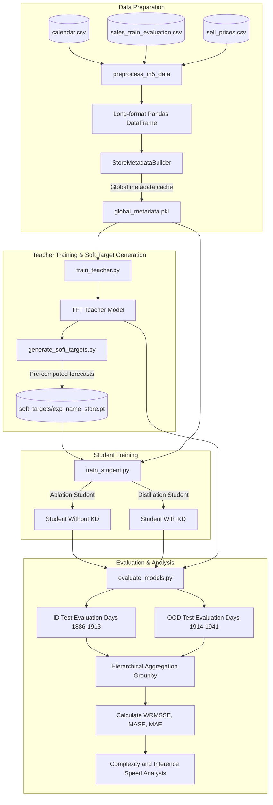
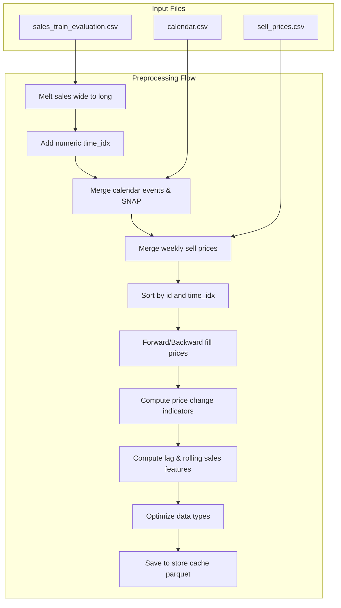

# Comprehensive Engineering Report: M5 Demand Forecasting via Knowledge Distillation

This report serves as a complete technical guide and reference manual for the M5 Demand Forecasting repository. It is designed to provide the deep, end-to-end technical understanding required to present and defend the project's architecture, methodology, and results during a Master's proposal defense and viva.

---

## PART 1 — BIG PICTURE

### What Problem is this Repository Solving?

High-dimensional, hierarchical time series forecasting is a critical challenge in retail operations (e.g., inventory management, supply chain optimization). The M5 dataset, sourced from Walmart, contains 30,490 individual product series across 10 stores in 3 states, arranged in a 12-level hierarchy. Modeling this dataset requires capturing complex temporal patterns, calendar events, promotions (SNAP benefits), and price variations, while handling massive data sparsity (intermittent demand, where daily sales are often zero).

Modern Deep Learning architectures, such as the **Temporal Fusion Transformer (TFT)**, excel at this task by dynamically selecting relevant features and modeling long-term temporal dependencies using self-attention. However, TFT models are computationally heavy, memory-intensive, and slow to run at inference time, making them difficult to deploy in resource-constrained environments (e.g., edge devices or real-time retail dashboards).

To solve this, this repository implements a **Knowledge Distillation (KD)** pipeline:
1. **Teacher Model (TFT)**: A high-capacity, multi-quantile Temporal Fusion Transformer is trained on the M5 data. It learns rich representations of temporal patterns, demand distributions, and feature interactions, generating high-quality forecasts.
2. **Soft Target Generation**: The trained teacher model is run in inference mode over the training period to generate daily forecasts. These forecasts represent "soft targets" that capture the teacher's uncertainty and probability distribution over future sales.
3. **Student Model (Transformer)**: A highly compact, lightweight Transformer student model is trained. Unlike the teacher, which uses LSTMs, VSNs, and multi-quantile heads, the student is a streamlined, decoder-free Transformer encoder.
4. **Knowledge Distillation**: The student is trained to minimize a combined loss function that balances ground-truth supervised targets and the teacher's soft targets. This allows the student to inherit the teacher's generalization capabilities and feature representations without the architectural complexity.
5. **Robustness & Generalization Evaluation**: The system is evaluated on both **In-Distribution (ID)** and **Out-of-Distribution (OOD)** windows to measure how well the models generalize to temporal distribution shifts, and to quantify the trade-offs between model size, inference speed, and forecasting accuracy (measured using the official M5 metric, **WRMSSE**).

### The Complete Pipeline



---

## PART 2 — DATA PIPELINE

Explain exactly how raw M5 data becomes model inputs.

Every step of raw data transformations serves to turn relational records into continuous sequential timelines.



### Pipeline Steps and Implementation

The data pipeline is orchestrated by [prepare_dataset.py](file:///c:/Users/jw/OneDrive%20-%20Universiti%20Malaya/Sem_2%20Study%20Material/WQF7023/repo/scripts/prepare_dataset.py) and implemented in [data/preprocessing.py](file:///c:/Users/jw/OneDrive%20-%20Universiti%20Malaya/Sem_2%20Study%20Material/WQF7023/repo/data/preprocessing.py).

#### 1. Merge Logic (Wide-to-Long Melting & Feature Joins)
*   **Why**: The raw sales file represents daily sales as 1941 columns (`d_1` to `d_1941`). Deep learning time series models require a single contiguous timeline row-by-row (long format) per product series. Joining calendar and price datasets is only possible once the timeline is linear.
*   **What**: Melt the sales table to long format, extract a numeric `time_idx` (1 to 1941) from `d`, and left-join calendar features on `d` and sell prices on `['store_id', 'item_id', 'wm_yr_wk']`.
*   **Where**: [data/preprocessing.py:L23-L47](file:///c:/Users/jw/OneDrive%20-%20Universiti%20Malaya/Sem_2%20Study%20Material/WQF7023/repo/data/preprocessing.py#L23-L47).

#### 2. Sorting & Missing Value Handling
*   **Why**: Sorting chronologically per series (`id`) is a prerequisite for pre-computing lags and rolling statistics without cross-group leakage. Prices are weekly, meaning daily joins leave gaps; these must be filled.
*   **What**: Sort the dataframe by `['id', 'time_idx']`. Apply forward-fill (`ffill`), then backward-fill (`bfill`) per product series group (`id`) on `sell_price`. Any remaining NaNs are filled with `0.0`.
*   **Where**: [data/preprocessing.py:L49-L53](file:///c:/Users/jw/OneDrive%20-%20Universiti%20Malaya/Sem_2%20Study%20Material/WQF7023/repo/data/preprocessing.py#L49-L53).

#### 3. Feature Engineering
*   **Why**: Machine learning models struggle to extract complex signals (like price elasticity or seasonal momentum) from raw numbers alone. Hand-crafted indicators speed up convergence.
*   **What**:
    *   *Price change indicator*: Binary flag indicating if the price changed from yesterday.
    *   *Percentage price change*: Percentage price difference compared to yesterday.
    *   *Sales lags*: Sales values from 7 days ago (`lag_7`) and 28 days ago (`lag_28`).
    *   *Rolling sales mean/std*: Computed over a 7-day window, but *shifted by 1 day* (using yesterday's history) to prevent target leakage at time $t$.
    *   *Zero sales indicator*: Binary flag representing zero daily sales.
*   **Where**: [data/preprocessing.py:L55-L76](file:///c:/Users/jw/OneDrive%20-%20Universiti%20Malaya/Sem_2%20Study%20Material/WQF7023/repo/data/preprocessing.py#L55-L76).

#### 4. Categorical Encoding & Data Type Optimization
*   **Why**: High-memory columns (like string dates) must be dropped to prevent RAM exhaustion. Category columns are stored as pandas categories to enable label encoding in PyTorch Forecasting. Downcasting floats to `float32` and integers to `int32` halves the RAM footprint.
*   **What**: Convert key identifiers and calendar descriptions to pandas categorical columns. Cast floats to `np.float32` and integers to `np.int32`. Drop high-memory columns: `date`, `d`, and `wm_yr_wk`.
*   **Where**: [data/preprocessing.py:L78-L96](file:///c:/Users/jw/OneDrive%20-%20Universiti%20Malaya/Sem_2%20Study%20Material/WQF7023/repo/data/preprocessing.py#L78-L96).

### Feature Classification

The engineered features are mapped to specific roles in the TimeSeriesDataSet in [configs/dataset.yaml](file:///c:/Users/jw/OneDrive%20-%20Universiti%20Malaya/Sem_2%20Study%20Material/WQF7023/repo/configs/dataset.yaml):

| Feature Name | Role | Data Type | Known Future? | Rationale |
| :--- | :--- | :--- | :--- | :--- |
| **sales** | Target / Unknown Real | `float32` | No | Target variable to forecast; historical sales act as inputs, future sales are unknown. |
| **item_id, dept_id, cat_id, store_id, state_id** | Static Categoricals | `category` | Yes (Static) | Structural grouping identifiers that do not change over time. Help the model learn group-specific biases. |
| **weekday, month, event_name_1, event_type_1** | Known Categoricals | `category` | Yes | Calendar features known in advance for both the historical and prediction windows. |
| **snap_CA, snap_TX, snap_WI** | Known Reals | `int32` | Yes | Binary flags representing SNAP benefits schedules. |
| **sell_price** | Known Real | `float32` | Yes | Sell prices are set in advance weekly and thus known for both encoder and decoder windows. |
| **price_change_indicator, percentage_price_change** | Known Reals | `int32 / float32` | Yes | Derived from prices, hence known for the entire prediction horizon. |
| **lag_7, lag_28** | Unknown Reals | `float32` | No | Lags of sales. Since they depend on sales, they are treated as unknown for the decoder window. |
| **rolling_mean_7, rolling_std_7** | Unknown Reals | `float32` | No | Rolling features of historical sales. |
| **zero_sales_indicator** | Unknown Real | `int32` | No | Binary flag representing if target sales at time $t$ was zero. |

---

## PART 3 — TIMESERIESDATASET

The `TimeSeriesDataSet` class from `pytorch_forecasting` is the core bridge between the long-format Pandas DataFrame and the PyTorch DataLoader. It handles windowing, categorical encoding, target scaling, and data representation.

### Detailed Configuration Parameters

```
|<----------------------- L = 90 Days (Lookback) ----------------------->|<------- H = 28 Days (Forecast) ------->|
[====================== ENCODER WINDOW (History) =======================][======== DECODER WINDOW (Horizon) =======]
|                                                                        |                                        |
|-- Static Categoricals (item_id, dept_id, cat_id, store_id, state_id) --|-- Static Categoricals (same) ----------|
|-- Known Categoricals (weekday, month, event_name_1, event_type_1) -----|-- Known Categoricals (same) -----------|
|-- Known Reals (snap_CA, snap_TX, snap_WI, sell_price, price changes) --|-- Known Reals (same) ------------------|
|-- Unknown Reals (sales, lag_7, lag_28, rolling_mean, rolling_std) -----|-- UNKNOWN REALS FILTERED OUT ----------|
```

*   **`lookback_window` (L = 90)**: The historical sequence length fed to the model (encoder). Represents the past context used to predict future sales.
*   **`prediction_window` (H = 28)**: The forecasting horizon (decoder). The sequence length of future predictions.
*   **`group_ids` (`["id"]`)**: The unique key representing an individual time series. The dataset splits and generates sliding windows independently per group.
*   **`time_idx` (`"time_idx"`)**: The integer day index (1 to 1941). Used to determine chronological order and detect missing records.
*   **`target` (`"sales"`)**: The variable to forecast.
*   **`static_categoricals`**: Features that do not change over time. Passed through embedding layers and concatenated to the sequence representations at every step.
*   **`time_varying_known_categoricals` & `time_varying_known_reals`**: Categorical/continuous variables whose future values are known (e.g. days of the week, holidays, prices). They are input into both the encoder and decoder.
*   **`time_varying_unknown_reals`**: Features whose future values are unknown (e.g., sales, lags, rolling stats). They are input *only* to the encoder (lookback window) and are masked/filtered out in the decoder window to prevent target leakage.

### Global Encoding and Normalization Design

In the partitioned streaming design, fitting encoders and normalizers on a per-store basis would lead to mismatched categorical indices (e.g. `item_id = "HOBBIES_1_001"` encoding to index `1` in store CA_1 but index `37` in store TX_1) and out-of-vocabulary errors during cross-store validation.

To solve this, a global `StoreMetadataBuilder` is implemented in [data/dataset.py:L190-L300](file:///c:/Users/jw/OneDrive%20-%20Universiti%20Malaya/Sem_2%20Study%20Material/WQF7023/repo/data/dataset.py#L190-L300):
1. **Fit Categorical Encoders globally**: Encoders (`NaNLabelEncoder`) are fitted on the complete list of categories across the entire M5 dataset (from `sales_train_evaluation.csv` and `calendar.csv`).
2. **Fit Target Normalizer globally**: A `GroupNormalizer(groups=["id"], transformation="softplus")` is fitted on all training-period sales. It calculates scaling factors (mean/standard deviation) independently for each individual series (`id`) to normalize targets. The `softplus` transformation ensures that normalized sales values remain non-negative.
3. **Instantiate Base DataSet**: A minimal base `TimeSeriesDataSet` is instantiated using a small DataFrame subset and the fitted global encoders/normalizer. This base dataset is saved as `global_metadata.pkl`.
4. **Partition Streaming**: When loading store partitions, `TimeSeriesDataSet.from_dataset(base_dataset, df_part_sliced)` is called. This copies the global vocabulary and target normalization parameters, ensuring that the tensors produced across all partitions are aligned.

### From DataFrame Row to Training Sample

A single training sample is created from a slice of length $L + H = 118$ days for a specific series (`id`).

```
Dataframe slice (118 rows for a single 'id')
    ↓
Target Normalization (GroupNormalizer divides target 'sales' and continuous features by group-specific scales)
    ↓
Split into Encoder (first 90 rows) and Decoder (last 28 rows)
    ↓
Categorical Label Encoding (Map categorical strings to integer indices using categorical_encoders)
    ↓
Tensor Assembly:
  - encoder_cat  : Shape (90, num_cat_cols)  — Integer category indices
  - encoder_cont : Shape (90, num_reals)     — Normalized float values
  - decoder_cat  : Shape (28, num_cat_cols)  — Integer category indices
  - decoder_cont : Shape (28, num_reals)     — Normalized float values (reals)
  - target       : Shape (28,)               — Ground truth sales for loss calculation
```

---

## PART 4 — SLIDING WINDOW

To generate training datasets from the historical timeline, the codebase uses a sliding window approach. 

### Sliding Window Mechanics

```
Day 1                     Day 90  Day 91                 Day 118
[--- LOOKBACK HISTORY (L=90) ---][-- FORECAST HORIZON (H=28) ---] -> Window 1
      ↓ (Shift by Stride S=7)
Day 8                     Day 97  Day 98                 Day 125
[--- LOOKBACK HISTORY (L=90) ---][-- FORECAST HORIZON (H=28) ---] -> Window 2
      ↓ (Shift by Stride S=7)
Day 15                    Day 104 Day 105                Day 132
[--- LOOKBACK HISTORY (L=90) ---][-- FORECAST HORIZON (H=28) ---] -> Window 3
```

For each time series group (`id`), the sliding window moves across the time index with a step size defined by `window_stride` ($S$).
*   **History length ($L$)**: 90 days.
*   **Forecast horizon ($H$)**: 28 days.
*   **Total window width**: $L + H = 118$ days.

### Sample Count Calculation

For a single time series spanning $N$ days (e.g. $N = 1857$ training days):
*   The first valid window starts at Day 1 and ends at Day 118 (decoder starts at Day 91).
*   The last window ends at Day $N$. The decoder start index is $N - H + 1$.
*   With a stride of $S$, the decoder start indices are:
    $$t_{\text{start}} \in \{L+1, L+1+S, L+1+2S, \dots\}$$
*   The total number of samples generated per series is:
    $$\text{Samples} = \left\lfloor \frac{N - (L + H)}{S} \right\rfloor + 1$$
*   For $N = 1857$, $L = 90$, $H = 28$, and stride $S = 7$:
    $$\text{Samples} = \left\lfloor \frac{1857 - 118}{7} \right\rfloor + 1 = \left\lfloor \frac{1739}{7} \right\rfloor + 1 = 248 + 1 = 249 \text{ samples per series}$$
*   For 30,490 series, this results in $249 \times 30,490 = 7,592,010$ training samples.

### The Stride=7 Rationale

In the preliminary study, a stride of 7 was selected in [configs/experiment/prelim.yaml:L3](file:///c:/Users/jw/OneDrive%20-%20Universiti%20Malaya/Sem_2%20Study%20Material/WQF7023/repo/configs/experiment/prelim.yaml#L3).
1. **Prevents RAM Exhaustion**: A stride of $S=1$ creates a dataset 7 times larger (approx. 53 million samples), which exceeds CPU memory capacity when building the dataloaders.
2. **Weekly Alignment**: A stride of 7 ensures that the decoder start day is always aligned to the same day of the week (e.g., always starting on a Monday). This matches the weekly structure of price updates and retail cycles, reducing temporal noise.
3. **Controls Redundancy**: Consecutive daily windows ($S=1$) overlap by 98.3% (117 out of 118 days are identical). Stepping by 7 days reduces this overlap to 94.0%, lowering data redundancy while retaining the core temporal signals.

---

## PART 5 — TFT TEACHER

The **Temporal Fusion Transformer (TFT)** is an attention-based architecture designed for multi-horizon forecasting. It incorporates specialized components to handle static covariates, time-varying features, and temporal dynamics.

```
                    [Inputs: Static, Known Future, Historical]
                                       │
                         ┌─────────────┴─────────────┐
                         ▼                           ▼
                 [Embeddings (Cat)]            [Reals (Cont)]
                         └─────────────┬─────────────┘
                                       ▼
                         [Variable Selection Network] (VSN)
                                       │ (Weighed features)
                                       ▼
                         [Gated Residual Network] (GRN)
                                       │
                                       ▼
                          [LSTM Temporal Encoder] (History)
                                       │
                         ┌─────────────┴─────────────┐
                         ▼                           ▼
                 [Self-Attention]             [LSTM Temporal Decoder]
                 (Long-term patterns)         (Short-term processing)
                         └─────────────┬─────────────┘
                                       ▼
                         [Post-Attention Processing]
                                       │
                                       ▼
                            [Quantile Output Head]
                            (Quantiles: 10%, 50%, 90%)
```

### Core Components and Tensor Flows

1. **Variable Selection Network (VSN)**:
    *   *Role*: Dynamically weights the importance of each input feature. It allows the model to ignore noisy or irrelevant variables.
    *   *Tensors*: Takes individual feature embedding tensors of shape `(batch_size, time, d_model)` and outputs a combined representation of shape `(batch_size, time, d_model)` along with selection weights of shape `(batch_size, time, num_features)`.
2. **Static Covariate Encoders**:
    *   *Role*: Integrates static metadata (e.g., store ID, category) into the temporal processing blocks, guiding the LSTMs and attention layers with static context.
3. **LSTM Temporal Encoder-Decoder**:
    *   *Role*: Learns local, sequential dependencies. The Encoder processes historical lookback data, while the Decoder processes future known inputs.
    *   *Tensors*: The encoder outputs hidden states of shape `(batch_size, L, d_model)`. These are passed to the decoder as initial states, which outputs sequence representations of shape `(batch_size, H, d_model)`.
4. **Interpretable Multi-Head Self-Attention**:
    *   *Role*: Learns long-term temporal interactions across historical and future horizons.
    *   *Tensors*: Computes Query (from decoder states), Key, and Value (from encoder states) projections to produce an attention output of shape `(batch_size, H, d_model)`.
5. **Quantile Output Layer & Loss**:
    *   *Role*: Projects the final states to multiple quantile predictions. Instead of predicting a single number, TFT outputs probability distributions (e.g., 10th, 50th, and 90th percentiles).
    *   *Tensors*: Projects `(batch_size, H, d_model)` to `(batch_size, H, num_quantiles)`.
    *   *Loss*: Trained using **Quantile Loss**:
        $$\mathcal{L}_q(y, \hat{y}) = \max\left( q(y - \hat{y}), (q - 1)(y - \hat{y}) \right)$$
        For a set of quantiles $Q = \{0.1, 0.5, 0.9\}$, the total loss is the average quantile loss.

### Median Prediction extraction

During distillation target generation in `generate_soft_targets.py`, we run:
```python
out = teacher(x_device)
pred_val = teacher.to_prediction(out)
```
TFT outputs predictions for all configured quantiles. The `.to_prediction(out)` call extracts the median quantile ($q=0.5$), which represents the point forecast of the target sales. This median prediction is used as the soft target for the student.

---

## PART 6 — STUDENT MODEL

The student model, implemented in [models/student.py](file:///c:/Users/jw/OneDrive%20-%20Universiti%20Malaya/Sem_2%20Study%20Material/WQF7023/repo/models/student.py), is a compact, decoder-free Transformer encoder. It bypasses the complexity of LSTMs and Variable Selection Networks, operating directly on concatenated sequence projections.

```
Lookback Inputs: Categoricals (Embs) & Reals (Cont)
    │ Concatenate
    ▼
[Full Encoder Feature Vector] (Shape: batch_size, L, total_cat_dim + num_reals)
    │
    ▼ [Linear: encoder_projector]
[Projected Encoder Sequence]  (Shape: batch_size, L, d_model)
    │
    │     Future Inputs: Categoricals (Embs) & Known Reals
    │         │ Concatenate
    │         ▼
    │     [Full Decoder Feature Vector] (Shape: batch_size, H, total_cat_dim + num_known_reals)
    │         │
    │         ▼ [Linear: decoder_projector]
    │     [Projected Decoder Sequence]  (Shape: batch_size, H, d_model)
    │         │
    ├─────────┘ Concatenate along sequence dimension
    ▼
[Combined Sequence Tensors]     (Shape: batch_size, L + H, d_model)
    │
    ▼ [nn.TransformerEncoder]
[Contextualized Sequence]       (Shape: batch_size, L + H, d_model)
    │
    ▼ Slice last H states (Prediction Window)
[Future States]                 (Shape: batch_size, H, d_model)
    │
    ▼ Flatten (Shape: batch_size, H * d_model)
[Flat Future States]
    │
    ▼ [MLP Head: Sequential(Linear -> ReLU -> Linear)]
[Point Predictions]             (Shape: batch_size, H)
```

### Tensor Map and Dimensional Analysis

We trace the tensor shapes for a batch size $B=64$, lookback window $L=90$, forecast window $H=28$, Transformer dimension $d_{\text{model}}=32$, embedding dimension $D_e=8$, and 11 categorical features.

#### 1. Input Tensors
*   `x['encoder_cat']`: Shape `(B, L, 11)` $\rightarrow$ `(64, 90, 11)`. Contains integer categorical codes.
*   `x['encoder_cont']`: Shape `(B, L, 12)` $\rightarrow$ `(64, 90, 12)`. Contains continuous features (e.g. sales, price, lags).
*   `x['decoder_cat']`: Shape `(B, H, 11)` $\rightarrow$ `(64, 28, 11)`.
*   `x['decoder_cont']`: Shape `(B, H, 12)` $\rightarrow$ `(64, 28, 12)`.

#### 2. Embeddings Projection
*   For each categorical variable, indices are projected to embeddings of shape `(64, 90, 8)` and `(64, 28, 8)`.
*   Concatenating categories results in `enc_embedded_tensor` of shape `(64, 90, 88)` and `dec_embedded_tensor` of shape `(64, 28, 88)` (since $11 \times 8 = 88$).

#### 3. Linear Projectors
*   **`encoder_projector`**: Projects the concatenated tensor `enc_full` of shape `(64, 90, 88 + 12 = 100)` to $d_{\text{model}}$.
    *   *Input Shape*: `(64, 90, 100)`.
    *   *Output Shape*: `(64, 90, 32)`.
    *   *Why it exists*: The historical lookback window contains unknown continuous variables (like sales, lags, and rolling features). This projector maps the full feature set to the Transformer representation space.
*   **`decoder_projector`**: Projects the concatenated tensor `dec_full` of shape `(64, 28, 88 + 7 = 95)` to $d_{\text{model}}$. Note that the decoder only uses the 7 known continuous features.
    *   *Input Shape*: `(64, 28, 95)`.
    *   *Output Shape*: `(64, 28, 32)`.
    *   *Why it exists*: To prevent target leakage, the decoder window must exclude unknown variables (such as sales and rolling stats). Since the input feature dimension differs from the encoder ($95$ vs $100$), a separate linear layer is required to project the features to the same $d_{\text{model}}$ space.

#### 4. Sequence Concatenation
*   `x_seq`: Concatenation of projected encoder and decoder sequences along the time dimension.
    *   *Shape*: `(64, 90 + 28, 32)` $\rightarrow$ `(64, 118, 32)`.

#### 5. Transformer Encoder
*   `enc_out = self.transformer_encoder(x_seq)`:
    *   *Shape*: `(64, 118, 32)`.
    *   *Meaning*: Sequence representations contextualized by self-attention. Each step has access to both historical and future known inputs.

#### 6. Prediction Head Slicing
*   `dec_out = enc_out[:, -28:, :]`: Slices the final 28 hidden states corresponding to the future forecast horizon.
    *   *Shape*: `(64, 28, 32)`.

#### 7. MLP Head Output Projection
*   `dec_flat = dec_out.reshape(64, 28 * 32)` $\rightarrow$ `(64, 896)`.
*   `preds = self.output_layer(dec_flat)`:
    *   *Layers*: `Linear(896, 48) -> ReLU() -> Linear(48, 28)`.
    *   *Output Shape*: `(64, 28)`. Represents point predictions for the 28-day forecast horizon.
    *   *Why MLP head is used instead of Step-wise projection*: A step-wise head projects each day's hidden state to its prediction independently, assuming the hidden state for day $t$ contains all the information needed for that day's forecast. A flat MLP head projects the flattened representation of all future states together, allowing the model to capture cross-day dependencies and temporal trends across the entire forecast window.

---

## PART 7 — KNOWLEDGE DISTILLATION

Knowledge Distillation (KD) transfers the predictive patterns learned by the complex teacher model to the lightweight student.

```
       [Raw Input Batch]
         ┌──────┴──────┐
         ▼             ▼
  [TFT Teacher]   [Transformer Student]
   (Frozen Wts)        (Trainable)
         │                 │
   (Point Preds)           │ (Predictions)
         ▼                 ▼
  [Soft Targets] ◄───► [Student Preds] ◄───► [Ground Truth Target]
         │                     │                     │
         └────────┬────────────┘                     │
                  ▼                                  ▼
         [Distillation Loss]                 [Supervised Loss]
            (Huber Loss)                       (Huber Loss)
                  │                                  │
                  └────────────────┬─────────────────┘
                                   ▼
                            [Combined Loss]
                             (Backpropagate)
```

### Distillation Target File Structure

The soft targets are pre-computed store-by-store in [generate_soft_targets.py](file:///c:/Users/jw/OneDrive%20-%20Universiti%20Malaya/Sem_2%20Study%20Material/WQF7023/repo/scripts/generate_soft_targets.py) to save training memory and time.
Each saved file (e.g. `exp_001_CA_1.pt`) contains a PyTorch dictionary:
```python
{
    "unique_groups": [0, 4, 12, ...], # List of global group index codes mapped in this store.
    "tensor": store_soft_targets      # Tensor of shape (num_store_groups, max_day + 1, H)
}
```
*   **`num_store_groups`**: The number of unique series (`id`) in the store partition (e.g., 3,049 groups).
*   **`max_day + 1`**: 1858 (corresponds to training day indices 0 to 1857).
*   **`H`**: The forecast horizon (28 days).
*   *Lookup Mechanism*: If a training sample is generated for group code $g$ starting its forecast at day $t$, the dataloader performs a lookup: `teacher_preds = store_soft_targets[global_to_local[g], t]`. This retrieves the 28-day prediction tensor for that window in $O(1)$ time, which is then passed in the training batch dictionary under the key `soft_targets`.

### The Distillation Loss Formulation

Traditional classification distillation uses cross-entropy or KL-divergence over probability distributions. Since demand forecasting is a continuous regression task, the teacher's output is a numerical value. Therefore, the distillation loss is formulated using regression metrics.

In [models/student.py:L86, L153-L156](file:///c:/Users/jw/OneDrive%20-%20Universiti%20Malaya/Sem_2%20Study%20Material/WQF7023/repo/models/student.py#L86), both supervised and distillation losses are calculated using **Huber Loss (Smooth L1 Loss)**. Huber loss acts as L1 loss when errors are large (limiting the influence of outliers) and as MSE loss when errors are small (ensuring smooth convergence).

$$L_{\delta}(y, \hat{y}) = \begin{cases} 
\frac{1}{2}(y - \hat{y})^2 & \text{for } |y - \hat{y}| \le \delta \\
\delta \left(|y - \hat{y}| - \frac{1}{2}\delta\right) & \text{otherwise}
\end{cases}$$

#### 1. Supervised Loss ($L_{\text{sup}}$)
Measures the error between the student's predictions and the true sales:
$$L_{\text{sup}} = \text{Huber}(y_{\text{student}}, y_{\text{true}})$$

#### 2. Distillation Loss ($L_{\text{dist}}$)
Measures the error between the student's predictions and the teacher's soft targets:
$$L_{\text{dist}} = \text{Huber}(y_{\text{student}}, y_{\text{teacher}})$$

#### 3. Combined Loss ($L$)
$$L = \alpha \cdot L_{\text{sup}} + (1 - \alpha) \cdot L_{\text{dist}}$$

*   **`alpha` ($\alpha$)**: The weighting parameter.
    *   If $\alpha = 1.0$, the training is purely supervised, ignoring the teacher's predictions (ablation student without KD).
    *   If $\alpha = 0.5$, the loss is balanced equally between the ground-truth targets and the teacher's forecasts.
    *   If $\alpha = 0.0$, the student is trained purely to emulate the teacher's predictions, ignoring the ground truth.

---

## PART 8 — EVALUATION PIPELINE

The evaluation script, [scripts/evaluate_models.py](file:///c:/Users/jw/OneDrive%20-%20Universiti%20Malaya/Sem_2%20Study%20Material/WQF7023/repo/scripts/evaluate_models.py), runs inference and compares the models against a baseline.

```
       [Evaluate Models on ID/OOD test periods]
                          │
         ┌────────────────┴────────────────┐
         ▼                                 ▼
   [Slice ID Test]                 [Slice OOD Test]
  (Days 1796-1913)                 (Days 1824-1941)
         │                                 │
         └────────────────┬────────────────┘
                          ▼
            [Create Dataloaders: predict=True]
            (Extracts exactly 1 sample per group)
                          │
         ┌────────────────┼────────────────┬────────────────┐
         ▼                ▼                ▼                ▼
   [Naive Forecast] [TFT Teacher]  [Student No KD]   [Student KD]
    (Shift Lag 28)    (Inference)    (Inference)      (Inference)
         │                │                │                │
         └────────────────┼────────────────┴────────────────┘
                          ▼
             [Concatenate store outputs]
                          │
                          ▼
            [Align IDs & sort alphabetically]
                          │
                          ▼
            [Aggregate to 12 M5 Levels]
                          │
                          ▼
            [Compute metrics: WRMSSE, MASE, MAE]
```

### Conceptual Code Walkthrough

1.  **Checkpoint Resolution & Loading**:
    *   Find and load PyTorch Lightning checkpoints for the TFT Teacher, Student (No KD), and Student (KD) models.
    *   *Key Functions*: `resolve_model_checkpoint()` and `load_from_checkpoint()`.
2.  **Dataset Construction**:
    *   Precompute WRMSSE weights and scales, and MASE scale factors using historical training data (`df_train`, Day $\le 1857$).
    *   Define evaluation windows: **ID Test** (Day 1886 to 1913) and **OOD Test** (Day 1914 to 1941).
    *   *Key Functions*: `compute_wrmsse_weights_and_scales()` and `compute_mase_scales()`.
3.  **Store-by-Store Inference**:
    *   For each evaluation window, slice a 118-day window ($L+H$) ending at the end of the test window.
    *   Construct the evaluation dataset with `predict=True`. This tells PyTorch Forecasting to extract only the last window for each time series, aligning the forecast horizon exactly with the test window.
    *   Generate predictions for all models. Measure and log inference times.
    *   *Key Functions*: `get_predictions()`.
4.  **Sorting & Alignment**:
    *   Concatenate predictions across all stores.
    *   Because partition streaming can yield records in varying orders, sort the concatenated predictions alphabetically by `id` to align them with the sorted ground-truth array.
5.  **Hierarchical Aggregation & Metric Calculation**:
    *   Aggregate predictions and actuals across the 12 hierarchical levels using `groupby().sum()`.
    *   Calculate point metrics (MAE, RMSE, WAPE), WRMSSE, and MASE for each model.
    *   *Key Functions*: `compute_point_metrics()`, `compute_hierarchical_wrmsse()`, and `compute_mase()`.
6.  **Comparison and Resource Analysis**:
    *   Compare model accuracy on ID vs. OOD windows, and calculate the performance degradation.
    *   Calculate model complexity by counting parameters and checking checkpoint sizes.

---

## PART 9 — HIERARCHICAL EVALUATION

The M5 competition evaluates forecasting accuracy across a 12-level hierarchy. Predictions are generated at the bottom level and aggregated upwards to compute hierarchical metrics.

```
Level 1: Total Sales (All products, stores, states) (1 series)
    ▲
Level 2 & 3: State & Store levels (3 states, 10 stores) (10 series)
    ▲
Level 4 & 5: Category & Department levels (3 categories, 7 depts) (7 series)
    ▲
Level 6 to 9: Joint spatial-product slices (e.g. State-Category) (70 series)
    ▲
Level 10 & 11: Item levels (3,049 items total & item-state splits) (9,147 series)
    ▲
Level 12: Bottom level (Individual product in a specific store) (30,490 series)
```

### Bottom-up Aggregation

Models in this repository generate forecasts exclusively for the bottom level (Level 12, consisting of 30,490 series). Sales at higher levels are computed by summing the bottom-level forecasts using Pandas `groupby().sum()` operations.

#### Three-Product Example
Consider a department with three products ($A, B, C$) in a single store:
*   **Actual Sales ($Y$)** at Day $t$:
    $$Y_A = 2, \quad Y_B = 0, \quad Y_C = 5 \implies Y_{\text{Total}} = 7$$
*   **Forecasted Sales ($\hat{Y}$)** at Day $t$:
    $$\hat{Y}_A = 1.8, \quad \hat{Y}_B = 0.5, \quad \hat{Y}_C = 4.2 \implies \hat{Y}_{\text{Total}} = 6.5$$

The total department forecast is the sum of the individual product forecasts:
$$\hat{Y}_{\text{Total}} = \hat{Y}_A + \hat{Y}_B + \hat{Y}_C = 6.5$$
This bottom-up aggregation is repeated for all 12 levels defined in `HIERARCHY_LEVELS`.

### Why Model only the Bottom Level?

1.  **Prevents Inconsistencies**: If separate models were trained for each level (e.g., one model for product sales and another for department sales), their predictions wouldn't match up (the sum of product forecasts wouldn't equal the department forecast). Forecasting at the bottom level and aggregating upwards ensures that predictions are consistent across the entire hierarchy.
2.  **Reduces Complexity**: Training and maintaining 42,840 individual models (one for every node in the M5 hierarchy) is computationally impractical. Forecasting at the bottom level requires only a single model.
3.  **Retains Granular Signals**: Aggregating raw data before modeling smooths out variance, which can mask product-specific patterns like local promotions or stockouts. Modeling at the bottom level allows the network to capture these granular details.

### Error Accumulation and Metric Discrepancies

*   **Error Accumulation**: Bottom-level forecasting is highly challenging due to the sparsity of daily sales data. Biases at the bottom level can accumulate when aggregated. If a model consistently overpredicts sales for individual items by a small fraction, this bias increases at higher levels of aggregation:
    $$\text{Bias}_{\text{Total}} = \sum_{i=1}^{30490} (Y_i - \hat{Y}_i)$$
*   **WRMSSE vs. MAE**: The Mean Absolute Error (MAE) treats all forecasting errors equally. The Weighted Root Mean Squared Scaled Error (WRMSSE) scales and weights errors based on their economic impact:
    $$WRMSSE = \frac{1}{12} \sum_{l=1}^{12} \sum_{i \in \text{groups}(l)} w_i \times \sqrt{ \frac{\text{MSE}_i}{\text{Scale}_i} }$$
    *   **Scale ($Scale_i$)**: The scale factor is the mean squared difference of the historical sales series. High-variance series have a larger denominator, which downweights their contribution to the error. Sparse, low-variance series have a smaller denominator, making the metric highly sensitive to errors on these items.
    *   **Weight ($w_i$)**: The weight is determined by the cumulative dollar sales value of the series over the last 28 days of the training set.
    *   *Result*: A model can improve its MAE by focusing on sparse, low-volume items (which make up the majority of the 30,490 series). However, because high-volume items carry much larger weights, minimizing WRMSSE requires accurate forecasts on these high-volume series. As a result, WRMSSE and MAE can sometimes disagree.

---

## PART 10 — ID/OOD

To evaluate model generalizability and robustness to distribution shifts, testing is split into In-Distribution (ID) and Out-of-Distribution (OOD) windows.

```
Day 1                                    Day 1857 Day 1885 Day 1913 Day 1941
[------------------ TRAINING -------------------][-- VAL -][-- ID ---][- OOD --]
                                                           │         │
                                                           │         └ OOD Test Window
                                                           │           (Temporal Shift)
                                                           └ ID Test Window
                                                             (No Shift)
```

*   **Training Period (Days 1 to 1857)**: The data range used to train both the teacher and student models.
*   **Validation Window (Days 1858 to 1885)**: A 28-day window used for hyperparameter tuning and early stopping.
*   **In-Distribution (ID) Test Window (Days 1886 to 1913)**: The test window immediately following the validation period. It shares similar seasonal patterns and price structures with the recent training data, representing standard in-distribution performance.
*   **Out-of-Distribution (OOD) Test Window (Days 1914 to 1941)**: A subsequent 28-day test window. Due to the temporal gap from the training set, this window is subject to seasonal changes, holiday shifts, and price adjustments, representing a temporal distribution shift.

### Temporal Distribution Shifts in Retail

Temporal distribution shifts are a common challenge in time series forecasting:
1.  **Seasonal Changes**: Consumer demand changes with the seasons (e.g., transitions from spring to summer). A model trained on winter data may struggle to predict summer demand.
2.  **Calendar Events**: Holiday dates shift from year to year (e.g., Thanksgiving or Easter), changing the timing of demand spikes.
3.  **Price Elasticity**: Changes in pricing and promotional schedules (such as SNAP benefits days) alter purchasing behavior.

Testing on both ID and OOD windows measures model **robustness**—the ability to maintain forecasting accuracy in the presence of these temporal shifts. Evaluating the performance gap between ID and OOD splits helps identify if a model is overfitting to recent seasonal trends.

---

## PART 11 — COMPLETE DATA FLOW

We trace the end-to-end data flow for a single product, **HOBBIES_1_001 in store CA_1**, from raw inputs to its contribution to the final WRMSSE metric.

```
[calendar.csv] ──┐
[sales.csv] ────┼─► [preprocess_m5_data] ─► [Store Parquet Cache] ─► [StoreMetadataBuilder] ─► [base_dataset]
[sell_prices.csv] ┘                                                  
                                                                           │
                                                                           ▼ [train_teacher.py]
                                                                     [TFT Teacher Model]
                                                                           │
                                                                           ▼ [generate_soft_targets.py]
                                                                     [Soft Targets (.pt)]
                                                                           │
                                                                           ▼ [train_student.py]
                                                                     [Student Model (KD)]
                                                                           │
                                                                           ▼ [evaluate_models.py (predict=True)]
                                                                     [Student Forecast (Day 1886-1913)]
                                                                           │
                                                                           ▼ [groupby().sum()]
                                                                     [Hierarchical Aggregation]
                                                                           │
                                                                           ▼ [compute_hierarchical_wrmsse]
                                                                     [Contribution to WRMSSE]
```

1.  **Raw CSV Files**:
    *   `sales_train_evaluation.csv`: Contains the row for `id = "HOBBIES_1_001_CA_1_evaluation"` with daily sales values: `[d_1: 0, d_2: 0, ..., d_1941: 2]`.
    *   `sell_prices.csv`: Contains weekly prices for `item_id = "HOBBIES_1_001"` in `store_id = "CA_1"`.
    *   `calendar.csv`: Contains daily calendar events and SNAP indicators for California (`snap_CA`).
2.  **Preprocessing (`preprocess_m5_data`)**:
    *   The wide sales row is melted into 1,941 rows.
    *   Calendar features (e.g., weekday, holidays) and weekly prices are joined.
    *   Lags and rolling statistics are calculated: for Day $t$, the rolling mean is computed using sales from Day $t-7$ to $t-1$.
    *   The processed data is saved to `preprocessed_CA_1.parquet`.
3.  **DataSet Building (`StoreMetadataBuilder`)**:
    *   `StoreMetadataBuilder` fits the categorical encoder for `id` (assigning a unique integer index, e.g., `1245`, to `"HOBBIES_1_001_CA_1_evaluation"`).
    *   It fits the target normalizer to calculate the series' historical scale.
    *   The global metadata is saved to `global_metadata.pkl`.
4.  **Teacher Training & Soft Target Generation**:
    *   The TFT teacher is trained on the training split (Days 1 to 1857).
    *   `generate_soft_targets.py` loads the trained teacher and runs inference on CA_1 for Days 1 to 1857.
    *   For each day, the teacher generates a 28-day forecast. The median predictions (quantile 0.5) are saved to `exp_001_CA_1.pt` as a tensor of shape `(num_groups, 1858, 28)`.
5.  **Student Training**:
    *   The student model is trained on CA_1.
    *   For a training batch containing Day $t$ for `"HOBBIES_1_001_CA_1_evaluation"`, the dataloader looks up the pre-computed teacher forecast from `exp_001_CA_1.pt` at index `[1245, t]`.
    *   The student is optimized using the combined loss function, learning from both the ground-truth sales and the teacher's soft targets.
6.  **Evaluation (`evaluate_models.py`)**:
    *   To evaluate on the ID Test window (Days 1886 to 1913), the script loads the last 118 days of CA_1 data (Days 1796 to 1913).
    *   With `predict=True`, the dataloader extracts a single evaluation sample for `"HOBBIES_1_001_CA_1_evaluation"`. The input contains historical features from Days 1796 to 1885, and known future features from Days 1886 to 1913.
    *   The student model processes this input and outputs a 28-day forecast: `[1.2, 0.8, ..., 1.5]` (shape: `(1, 28)`).
7.  **Hierarchical Aggregation**:
    *   The 28-day forecast for `"HOBBIES_1_001_CA_1_evaluation"` is mapped back to the evaluation dataframe.
    *   The forecasts are aggregated upwards through the 12 hierarchical levels:
        *   **Level 12**: Remains as `"HOBBIES_1_001_CA_1"` (individual series).
        *   **Level 11**: Aggregated with other stores in California to form `"HOBBIES_1_001_CA"`.
        *   **Level 10**: Aggregated across all stores nationwide to form `"HOBBIES_1_001"`.
        *   ...
        *   **Level 1**: Summed with all other items across all stores and states to compute the `"Total"` forecast.
8.  **WRMSSE Calculation**:
    *   For each aggregation level, the Mean Squared Error (MSE) between the aggregated forecasts and actual sales is calculated.
    *   The MSE is scaled by the historical scale factor and weighted by the dollar sales volume of the series.
    *   The final WRMSSE is the average WRMSSE across all 12 levels.

---

## PART 12 — CODE MAP

### Repository Directory Map

```
repo/
│
├── configs/                   # Configuration files (YAML)
│   ├── environment/           # Environment-specific directories (local, kaggle)
│   ├── experiment/            # Experiment profiles (prelim, full)
│   ├── dataset.yaml           # Global data parameters and splits
│   ├── evaluation.yaml        # Evaluation setup and metrics
│   ├── feature_cache.yaml     # Feature version tracking
│   ├── student.yaml           # Student hyperparameters
│   └── teacher.yaml           # Teacher hyperparameters
│
├── data/                      # Data preprocessing and dataset classes
│   ├── cache.py               # Cache management (versioning, loading/saving)
│   ├── dataset.py             # Global metadata builder, custom datasets, and loaders
│   └── preprocessing.py       # Data cleaning, melting, and feature engineering
│
├── models/                    # Model architecture definitions
│   ├── student.py             # Custom Transformer student model
│   └── teacher.py             # Wrapper for TFT teacher instantiation
│
└── scripts/                   # Execution scripts for pipeline stages
    ├── prepare_dataset.py     # Preprocesses raw CSVs and caches data
    ├── train_teacher.py       # Trains the TFT teacher model
    ├── generate_soft_targets.py # Generates and saves soft targets from the teacher
    ├── train_student.py       # Trains the student model (with or without KD)
    └── evaluate_models.py     # Evaluates model performance on ID/OOD test windows
```

### Module Specifications

#### 1. [data/preprocessing.py](file:///c:/Users/jw/OneDrive%20-%20Universiti%20Malaya/Sem_2%20Study%20Material/WQF7023/repo/data/preprocessing.py)
*   **Purpose**: Cleans raw M5 CSV datasets, melts wide-format sales records into a long-format DataFrame, joins price and calendar tables, and engineers historical sales features.
*   **Inputs**: `calendar.csv`, `sales_train_evaluation.csv`, `sell_prices.csv`.
*   **Outputs**: A processed DataFrame in long format.
*   **Dependencies**: `pandas`, `numpy`, `utils.paths`.
*   **Key Functions**:
    *   `preprocess_m5_data(input_dir, store_filter)`: Runs the preprocessing pipeline for a specified store.

#### 2. [data/cache.py](file:///c:/Users/jw/OneDrive%20-%20Universiti%20Malaya/Sem_2%20Study%20Material/WQF7023/repo/data/cache.py)
*   **Purpose**: Manages the loading, saving, and versioning of the preprocessed store Parquet files.
*   **Inputs**: Path directories, DataFrames, and store filters.
*   **Outputs**: Boolean cache status, cached DataFrames, or saved Parquet files on disk.
*   **Dependencies**: `pandas`, `yaml`, `glob`, `utils.paths`.
*   **Key Functions**:
    *   `is_cache_valid(artifacts_dir, store_filter)`: Checks if a cache file exists and matches the current `FEATURE_VERSION` in `feature_cache.yaml`.
    *   `save_to_cache(df, artifacts_dir, store_filter)`: Saves a DataFrame to Parquet and writes a `.version` sidecar file.
    *   `load_from_cache(artifacts_dir, store_filter)`: Loads a cached DataFrame. Raises an error if the cache is stale.

#### 3. [data/dataset.py](file:///c:/Users/jw/OneDrive%20-%20Universiti%20Malaya/Sem_2%20Study%20Material/WQF7023/repo/data/dataset.py)
*   **Purpose**: Manages the construction of the PyTorch Forecasting datasets and dataloaders. Implements global metadata building and partitioned streaming for large datasets.
*   **Inputs**: Preprocessed DataFrames, configuration objects.
*   **Outputs**: TimeSeriesDataSet structures, custom IterableDatasets, and PyTorch DataLoaders.
*   **Dependencies**: `pytorch_forecasting`, `torch.utils.data`, `pandas`, `numpy`, `pickle`.
*   **Key Functions**:
    *   `StoreMetadataBuilder.fit(parquet_dir)`: Fits categorical encoders and target normalizers globally, caching the base dataset structure.
    *   `StorePartitionedDataset`: A custom PyTorch `IterableDataset` that streams training or evaluation data store-by-store to manage RAM usage.
    *   `StorePartitionManager`: Coordinates dataloader instantiation for training, validation, and testing.

#### 4. [models/teacher.py](file:///c:/Users/jw/OneDrive%20-%20Universiti%20Malaya/Sem_2%20Study%20Material/WQF7023/repo/models/teacher.py)
*   **Purpose**: Instantiates the Temporal Fusion Transformer teacher model from a training dataset configuration.
*   **Inputs**: Training TimeSeriesDataSet, configuration object.
*   **Outputs**: A `TemporalFusionTransformer` instance.
*   **Dependencies**: `pytorch_forecasting`.
*   **Key Functions**:
    *   `create_tft_teacher(training_dataset, cfg)`: Configures and returns the TFT teacher model.

#### 5. [models/student.py](file:///c:/Users/jw/OneDrive%20-%20Universiti%20Malaya/Sem_2%20Study%20Material/WQF7023/repo/models/student.py)
*   **Purpose**: Implements the custom lightweight Transformer student model and its PyTorch Lightning training/validation steps.
*   **Inputs**: Training dataset (for vocabulary size checks), hyperparameters, and optional pre-computed soft targets.
*   **Outputs**: Model predictions, loss tensors.
*   **Dependencies**: `torch`, `torch.nn`, `lightning.pytorch`.
*   **Key Functions**:
    *   `forward(x)`: Implements the forward pass (embedding projection, sequence concatenation, self-attention, and output MLP head).
    *   `training_step(batch, batch_idx)`: Calculates the combined supervised and distillation loss during training.

#### 6. [scripts/prepare_dataset.py](file:///c:/Users/jw/OneDrive%20-%20Universiti%20Malaya/Sem_2%20Study%20Material/WQF7023/repo/scripts/prepare_dataset.py)
*   **Purpose**: Command-line entry point to run preprocessing and cache the global metadata builder.
*   **Inputs**: CLI environment arguments.
*   **Outputs**: Cached Parquet files and `global_metadata.pkl` saved to disk.
*   **Dependencies**: `argparse`, `data.preprocessing`, `data.cache`, `data.dataset`.

#### 7. [scripts/train_teacher.py](file:///c:/Users/jw/OneDrive%20-%20Universiti%20Malaya/Sem_2%20Study%20Material/WQF7023/repo/scripts/train_teacher.py)
*   **Purpose**: Trains the TFT teacher model using PyTorch Lightning.
*   **Inputs**: CLI arguments for epochs, batch sizes, and experiment configurations.
*   **Outputs**: Trained model checkpoints saved to disk.
*   **Dependencies**: `lightning.pytorch`, `utils.config`, `data.dataset`, `models.teacher`.

#### 8. [scripts/generate_soft_targets.py](file:///c:/Users/jw/OneDrive%20-%20Universiti%20Malaya/Sem_2%20Study%20Material/WQF7023/repo/scripts/generate_soft_targets.py)
*   **Purpose**: Generates and saves the teacher's forecasts over the training period to serve as soft targets for the student.
*   **Inputs**: Trained TFT teacher checkpoint, configuration settings, CLI arguments.
*   **Outputs**: Pre-computed forecast tensors saved as `.pt` files per store, along with `.json` provenance metadata files.
*   **Dependencies**: `torch`, `numpy`, `pytorch_forecasting`, `data.cache`, `data.dataset`.

#### 9. [scripts/train_student.py](file:///c:/Users/jw/OneDrive%20-%20Universiti%20Malaya/Sem_2%20Study%20Material/WQF7023/repo/scripts/train_student.py)
*   **Purpose**: Trains the lightweight Transformer student model (with KD or No KD) using PyTorch Lightning.
*   **Inputs**: Config parameters, experiment names, and paths to soft targets.
*   **Outputs**: Student model checkpoints and training logs.
*   **Dependencies**: `lightning.pytorch`, `utils.config`, `data.dataset`, `models.student`.

#### 10. [scripts/evaluate_models.py](file:///c:/Users/jw/OneDrive%20-%20Universiti%20Malaya/Sem_2%20Study%20Material/WQF7023/repo/scripts/evaluate_models.py)
*   **Purpose**: Runs inference for all models on the ID and OOD test windows, aggregates forecasts, and computes accuracy and complexity metrics.
*   **Inputs**: Checkpoints for all models, configuration parameters.
*   **Outputs**: An evaluation results CSV (`evaluation_results.csv`) and printed performance comparisons.
*   **Dependencies**: `torch`, `numpy`, `pandas`, `pytorch_forecasting`, `models.student`.

---

## PART 13 — DEFENSE QUESTIONS

This section contains 80 technical questions categorized by project area. It is designed to help prepare for proposal defenses and viva examinations.

---

### Category A: Data Pipeline & Preprocessing (12 Questions)

#### Q1: Why is the M5 dataset melted from wide to long format during preprocessing?
*   **Ideal Answer**: Deep learning models for time series require input data formatted as continuous, chronological sequences. The raw M5 dataset stores daily sales as columns (`d_1` to `d_1941`), which is a wide format. Melting this representation into a long-format DataFrame collapses days into rows, creating a linear timeline per series (`id`). This transformation is necessary to join daily features (like calendar events and prices) and construct sliding windows for training.
*   **Common Mistake**: Stating that melting is done to reduce disk space. In fact, long-format datasets consume more storage than wide-format tables because static identifiers are duplicated across rows.
*   **Follow-up Questions**:
    *   What is the index structure of the long-format DataFrame?
    *   How does the long format impact memory usage during DataFrame merges?

#### Q2: How does the data pipeline handle weekly price updates to align with daily sales?
*   **Ideal Answer**: Price data in `sell_prices.csv` is recorded weekly and mapped to a weekly calendar index (`wm_yr_wk`). In contrast, sales are recorded daily. During preprocessing, calendar variables are first merged with sales data to map each day (`d`) to its corresponding week (`wm_yr_wk`). The weekly prices are then joined on `['store_id', 'item_id', 'wm_yr_wk']`. To handle cases where a product has no price recorded for a given week, a forward-fill (`ffill`), then backward-fill (`bfill`) is applied per product series (`id`). Any remaining missing prices are filled with `0.0`.
*   **Common Mistake**: Using a simple global forward-fill, which can leak price information across different products. Price fills must be grouped by series (`id`).
*   **Follow-up Questions**:
    *   Why might a product have missing prices in the raw dataset?
    *   How does setting missing prices to `0.0` affect the model's behavior?

#### Q3: Why are the rolling mean and standard deviation features shifted by 1 day?
*   **Ideal Answer**: Calculating a rolling mean at Day $t$ using the sales value from Day $t$ introduces **target leakage**, as the model would have access to the target variable it is trying to predict. To prevent this, the sales timeline is shifted by 1 day (`shift(1)`) before calculating rolling statistics. This ensures that the features for Day $t$ are computed using sales data from Day $t-1$ and earlier, preserving the autoregressive structure of the task.
*   **Common Mistake**: Calculating the rolling window directly on the target column without shifting, which leads to artificially high validation accuracy that fails during inference.
*   **Follow-up Questions**:
    *   What is the mathematical formulation of the 7-day rolling mean for Day $t$ after a 1-day shift?
    *   How do lag features like `lag_7` relate to target leakage?

#### Q4: Why are categorical variables encoded globally using `StoreMetadataBuilder` rather than locally per store partition?
*   **Ideal Answer**: In the partitioned streaming setup, each store's data is processed independently. If categorical variables (like `item_id`) were encoded locally, the integer mapping would vary by store (e.g., `"HOBBIES_1_001"` might map to index `1` in store CA_1 but index `37` in store TX_1). Furthermore, evaluating a model on a store containing items that were absent from its training set would trigger out-of-vocabulary errors. `StoreMetadataBuilder` fits the encoders globally on the entire M5 dataset vocabulary, ensuring consistent index mappings across all partitions.
*   **Common Mistake**: Claiming that global encoding is done to speed up model convergence. It is actually a structural requirement for partition consistency and validation stability.
*   **Follow-up Questions**:
    *   How does the `NaNLabelEncoder` handle out-of-vocabulary items?
    *   What is the memory impact of loading the global metadata cache during training?

#### Q5: What target normalizer is used, and why is it fitted only on the training period?
*   **Ideal Answer**: The pipeline uses a `GroupNormalizer(groups=["id"], transformation="softplus")` from PyTorch Forecasting. It calculates scale factors (mean and standard deviation) for each individual time series (`id`). The target sales are normalized by subtracting the mean and dividing by the standard deviation. The `softplus` transformation ensures that the normalized values remain positive. The normalizer is fitted exclusively on the training period (Days 1 to 1857) to prevent validation and test information from leaking into the training step.
*   **Common Mistake**: Fitting the normalizer on the entire dataset (Days 1 to 1941), which introduces data leakage from the evaluation windows.
*   **Follow-up Questions**:
    *   Why is target normalization important for neural network-based forecasting models?
    *   How are predictions scaled back to their original values during evaluation?

#### Q6: Why are float columns downcast to `np.float32` and integers to `np.int32`?
*   **Ideal Answer**: The long-format M5 dataset contains millions of rows. Pandas defaults to 64-bit precision (`float64` and `int64`), which consumes significant memory. Downcasting these columns to 32-bit precision (`float32` and `int32`) halves the memory footprint of the DataFrames, preventing Out-Of-Memory (OOM) errors during merges and dataset construction without affecting numerical accuracy.
*   **Common Mistake**: Suggesting that downcasting is done to improve the model's accuracy. It is purely a memory and computational efficiency optimization.
*   **Follow-up Questions**:
    *   What is the memory difference in megabytes for a DataFrame with 10 million rows when downcasting from 64-bit to 32-bit?
    *   Does PyTorch default to 32-bit or 64-bit precision for tensor computations?

#### Q7: Why are high-memory columns like `date`, `d`, and `wm_yr_wk` dropped after preprocessing?
*   **Ideal Answer**: String columns (like `d_1` or `"2016-04-24"`) consume significant memory in Pandas and cannot be directly input into PyTorch models. Once their information has been extracted into numeric indices (such as `time_idx`) and categorical codes, these raw columns are dropped to free up memory before caching the data to disk.
*   **Common Mistake**: Retaining these columns for evaluation. Any necessary metadata alignment is handled using the numeric `time_idx`.
*   **Follow-up Questions**:
    *   How is calendar metadata recovered during the evaluation step without the `date` column?
    *   How does the size of the saved Parquet cache change when these columns are dropped?

#### Q8: How does the pipeline identify known future features vs. unknown observed features?
*   **Ideal Answer**: The distinction is defined in the configuration file [configs/dataset.yaml](file:///c:/Users/jw/OneDrive%20-%20Universiti%20Malaya/Sem_2%20Study%20Material/WQF7023/repo/configs/dataset.yaml). Continuous features listed under `time_varying_unknown_reals` (such as sales, lags, and rolling stats) are treated as unknown in the future. The student model's initialization identifies these columns and filters them out of the decoder window, ensuring that future values of unknown variables are not leaked during training.
*   **Common Mistake**: Classifying lag features as known future features under the assumption that they can be calculated ahead of time. Because lags are derived from the target variable, their future values are unknown.
*   **Follow-up Questions**:
    *   Which index range in the input tensor represents the decoder window?
    *   What happens if an unknown feature is accidentally included in the decoder window?

#### Q9: What is the purpose of the `.version` sidecar files in the data cache?
*   **Ideal Answer**: The `.version` file stores the `feature_version` integer from `configs/feature_cache.yaml` alongside the cached store Parquet file. Before loading a cached file, the pipeline verifies that the stored version matches the current configuration. If the feature engineering logic is updated and the version is incremented, the pipeline detects the mismatch, invalidates the stale cache, and regenerates the Parquet files to prevent training on outdated features.
*   **Common Mistake**: Manually deleting the cache files when updates are made. The versioning system handles cache invalidation automatically.
*   **Follow-up Questions**:
    *   What function implements this cache validation check?
    *   What happens if a cache file exists but its `.version` sidecar is missing?

#### Q10: How are calendar events (like holidays) encoded, and how are missing events handled?
*   **Ideal Answer**: Calendar events are read from `calendar.csv` as string columns (`event_name_1`, `event_type_1`). Missing records (days without holidays) are represented as NaNs. During preprocessing, these NaNs are filled with the string `"None"`. The columns are then converted to category types, and the global metadata builder maps them to integer indices (where `"None"` is assigned its own index). This allows the model to treat the absence of an event as a distinct category.
*   **Common Mistake**: Leaving missing events as NaNs, which causes errors during label encoding and tensor conversion.
*   **Follow-up Questions**:
    *   Why are there two event columns (`event_name_1` and `event_name_2`) in the raw calendar data?
    *   How does the model learn the impact of different holiday types (e.g. sporting vs. religious events)?

#### Q11: What is the role of the SNAP indicator columns, and why are they treated as time-varying known reals?
*   **Ideal Answer**: SNAP (Supplemental Nutrition Assistance Program) benefits schedules are known in advance. In the M5 dataset, they are represented as binary flags (`snap_CA`, `snap_TX`, `snap_WI`) indicating if benefits are distributed in a state on a given day. Because these schedules are fixed and known ahead of time, they are classified as time-varying known reals. This allows the model to use SNAP schedules in both the historical lookback window and the future prediction horizon to capture changes in customer purchasing power.
*   **Common Mistake**: Treating SNAP indicators as static variables. Because benefits are distributed on specific days of the month, these indicators vary over time.
*   **Follow-up Questions**:
    *   Why are there separate SNAP columns for California, Texas, and Wisconsin?
    *   How do SNAP distribution days affect retail demand patterns?

#### Q12: Why is the price change indicator represented as a binary column?
*   **Ideal Answer**: Retail demand is sensitive to price changes. A binary price change indicator (`price_change_indicator`) flags whether a product's price changed from the previous day. This simplifies the price signal, allowing the model to capture immediate changes in customer demand following a price adjustment without having to calculate price changes from raw float values.
*   **Common Mistake**: Assuming the indicator only captures price cuts. It is an absolute flag that triggers on both price increases and decreases.
*   **Follow-up Questions**:
    *   How is the percentage price change feature calculated alongside the binary indicator?
    *   How does the model handle price updates that occur mid-week?

---

### Category B: TimeSeriesDataSet & Sliding Window (12 Questions)

#### Q13: What is the relationship between `lookback_window` and `prediction_window`?
*   **Ideal Answer**: `lookback_window` ($L$) is the history window (90 days) used as input to capture temporal patterns. `prediction_window` ($H$) is the forecasting horizon (28 days) over which the model generates predictions. Together, they define the sliding window width ($L + H = 118$ days). During training, the model uses the first $L$ days to predict the target values in the subsequent $H$ days.
*   **Common Mistake**: Stating that they must be equal. The lookback window is typically longer than the forecast horizon to provide the model with sufficient historical context.
*   **Follow-up Questions**:
    *   How does increasing the encoder length affect GPU memory usage?
    *   What are the trade-offs of using a shorter lookback window?

#### Q14: How does `predict=True` change the behavior of the `TimeSeriesDataSet` during evaluation?
*   **Ideal Answer**: By default (`predict=False`), the dataset generator extracts all possible sliding windows from the timeline. When `predict=True`, the dataset generator extracts only the **last** window for each unique group (`id`) ending at the maximum time index. This generates exactly one sample per series, aligning the forecast horizon with the evaluation window and preventing the creation of overlapping prediction windows.
*   **Common Mistake**: Assuming `predict=True` changes the model's forward pass. It is a configuration that alters how the dataset samples are generated from the DataFrame.
*   **Follow-up Questions**:
    *   How many samples are returned by the dataloader when `predict=True` is run on a store partition with 3,049 items?
    *   What is the start day of the prediction window when `predict=True` is used on the ID Test split?

#### Q15: How does the sliding window partition step size (stride) affect dataset size?
*   **Ideal Answer**: The stride ($S$) determines how many days the window shifts between samples. A stride of $S=1$ extracts every possible window, resulting in a large dataset with significant overlap between consecutive samples. Increasing the stride to $S=7$ extracts a sample every 7 days, reducing the dataset size by a factor of 7. This helps manage memory usage and speeds up training while retaining the weekly seasonal patterns.
*   **Common Mistake**: Assuming a larger stride increases the model's accuracy. A larger stride reduces the number of training samples, which can lead to faster training but may miss short-term patterns if the dataset is too small.
*   **Follow-up Questions**:
    *   What is the formula to calculate the number of samples per series given $N$, $L$, $H$, and $S$?
    *   How does the choice of stride affect the training time per epoch?

#### Q16: Why are time series grouped by the `"id"` column?
*   **Ideal Answer**: The `"id"` column represents a unique product-store combination (e.g., `"HOBBIES_1_001_CA_1"`). Grouping by `"id"` ensures that sliding windows are generated independently for each individual series. This prevents data from different products or stores from being mixed within a single timeline.
*   **Common Mistake**: Grouping by `item_id` only, which mixes sales data from different stores and distorts the localized demand signal.
*   **Follow-up Questions**:
    *   How many unique groups exist in the CA_1 store partition?
    *   How does the model distinguish between different groups during training?

#### Q17: What is the role of the `time_idx` column in the dataset?
*   **Ideal Answer**: The `time_idx` column is an integer day index (1 to 1941). It is used by the dataset class to sort the records chronologically, identify missing days, and align features across different series. It also serves as the reference point for splitting the data into training, validation, and test windows.
*   **Common Mistake**: Using the raw date string as the time index, which cannot be processed by the PyTorch Forecasting dataset generator.
*   **Follow-up Questions**:
    *   What range of `time_idx` values corresponds to the training split?
    *   How does the dataset class handle gaps in the `time_idx` sequence?

#### Q18: What is the difference between static categoricals and time-varying known categoricals?
*   **Ideal Answer**: Static categoricals represent features that do not change over time (e.g., `item_id` or `store_id`). Time-varying known categoricals represent features that change over time but are known in advance (e.g., `weekday` or `month`). Static features are embedded once and concatenated across the entire sequence, while time-varying features are embedded at each time step.
*   **Common Mistake**: Classifying `weekday` as a static categorical feature because its weekly pattern is fixed. Since the day of the week changes daily, it varies over time.
*   **Follow-up Questions**:
    *   How are static categoricals processed by the student model's embedding layers?
    *   Which features in the dataset are classified as static categoricals?

#### Q19: Why are continuous variables (reals) split into known and unknown categories?
*   **Ideal Answer**: This classification prevents **target leakage**. Known reals (like `sell_price` or `snap_CA`) are known in advance and can be input into both the encoder (history) and decoder (future) windows. Unknown reals (like `sales` or rolling sales statistics) are not known in the future. They are input only into the encoder window and are masked in the decoder window to prevent the model from accessing future target values during training.
*   **Common Mistake**: Treating lag features as known reals under the assumption that they are known because they represent historical sales. Since their values in the decoder window depend on future sales, they are unknown.
*   **Follow-up Questions**:
    *   How are unknown reals masked in the decoder window within the student model?
    *   What is the shape of the decoder continuous input tensor?

#### Q20: How does the `StorePartitionedDataset` stream data during training?
*   **Ideal Answer**: Loading the entire preprocessed M5 dataset into RAM at once can exceed memory capacity. To manage this, `StorePartitionedDataset` inherits from PyTorch's `IterableDataset` and streams data store-by-store. It loads a single store's preprocessed Parquet file, constructs a local `TimeSeriesDataSet`, generates batches for that store, and yields them. Once the store's batches are processed, it releases the memory and moves to the next store, keeping memory usage stable.
*   **Common Mistake**: Attempting to load all stores into a single DataFrame before creating the dataloader, which can lead to Out-Of-Memory errors on standard hardware.
*   **Follow-up Questions**:
    *   How does streaming affect the randomness of batch generation during training?
    *   Why is the order of stores shuffled at the start of each epoch?

#### Q21: What is the role of `StorePartitionManager`?
*   **Ideal Answer**: `StorePartitionManager` acts as the interface for constructing the training, validation, and test dataloaders. It coordinates the creation of the underlying `StorePartitionedDataset` instances with the correct batch size, split indices, and experiment flags, simplifying data access for the trainer.
*   **Common Mistake**: Assuming the partition manager loads the data itself. It is a configuration wrapper that instantiates the dataloaders.
*   **Follow-up Questions**:
    *   What parameters are passed to `StorePartitionManager` when initializing the validation dataloader?
    *   How is the test dataloader configured to prevent shuffling during evaluation?

#### Q22: Why is the `StoreMetadataBuilder` saved as a pickle file?
*   **Ideal Answer**: Fitting categorical encoders and target normalizers globally is a computationally slow process. By saving the fitted `StoreMetadataBuilder` to a pickle file (`global_metadata.pkl`), the pipeline can reload the pre-computed encoders and normalizers in subsequent training runs. This avoids having to refit them on the raw data, saving time and ensuring consistent feature mappings.
*   **Common Mistake**: Modifying the feature config without deleting the pickle file, which causes the pipeline to load outdated encoders and leads to shape mismatch errors.
*   **Follow-up Questions**:
    *   What information is stored inside the `global_metadata.pkl` file?
    *   How does the training script load and update this metadata?

#### Q23: How does the dataset handle the zero-sales indicator feature?
*   **Ideal Answer**: The zero-sales indicator is a binary flag indicating if a product had zero sales on a given day. It is classified as an unknown real feature, meaning it is input only into the encoder window. This feature helps the model identify patterns of intermittent demand, distinguishing between periods of zero sales and active sales.
*   **Common Mistake**: Treating the zero-sales indicator as a known future feature, which leaks information about future sales.
*   **Follow-up Questions**:
    *   How is the zero-sales indicator calculated during preprocessing?
    *   What is the mathematical relationship between the zero-sales indicator and the target variable?

#### Q24: What is the purpose of the `filter()` function in `StorePartitionedDataset`?
*   **Ideal Answer**: The `filter()` function is used to apply the training stride ($S$). It filters the generated samples by checking the start index of their prediction window (`time_idx_first_prediction`), keeping only those windows where the index is divisible by the stride. This ensures that the subsampled windows are aligned to consistent calendar positions across all series.
*   **Common Mistake**: Shuffling the dataset rows and then selecting every 7th row. This would result in arbitrary window offsets rather than calendar-aligned strides.
*   **Follow-up Questions**:
    *   How is `time_idx_first_prediction` calculated by the dataset generator?
    *   What is the difference between a stride of 1 and a stride of 7 in terms of the filtered dataset size?

---

### Category C: Model Architecture (12 Questions)

#### Q25: What is the main structural difference between the TFT Teacher and the Transformer Student?
*   **Ideal Answer**: The TFT Teacher is an Encoder-Decoder architecture that uses LSTMs for local processing, Variable Selection Networks (VSN) for feature weighting, and multi-quantile heads for probabilistic forecasting. The Transformer Student is a compact, decoder-free Transformer encoder. It projects the combined features directly to a hidden dimension, processes the concatenated history and future inputs using self-attention, and projects the final states to a point prediction using a flat MLP head.
*   **Common Mistake**: Stating that the student uses an encoder-decoder structure because it has encoder and decoder projection layers. These projection layers only map the features to a common dimension; the core model is a single Transformer encoder.
*   **Follow-up Questions**:
    *   Why does the student use a decoder-free architecture?
    *   How does this structural simplification affect the parameter count?

#### Q26: Why does the student model have separate `encoder_projector` and `decoder_projector` layers?
*   **Ideal Answer**: The encoder window uses all features (static, known, and unknown), while the decoder window excludes unknown features to prevent target leakage. Because the input feature dimension differs between the encoder and decoder windows (e.g., 100 features vs. 95 features), separate linear projection layers are required to map the inputs to the same Transformer hidden dimension ($d_{\text{model}}$).
*   **Common Mistake**: Assuming a single projection layer can process both windows by padding the missing features in the decoder. While possible, using separate projectors is more parameter-efficient and avoids introducing padding noise.
*   **Follow-up Questions**:
    *   What are the input and output dimensions of the `encoder_projector`?
    *   What would happen if the decoder window used the `encoder_projector`?

#### Q27: Why is the student's output head implemented as a flat MLP instead of a step-wise projection?
*   **Ideal Answer**: A step-wise head projects each day's hidden state to its prediction independently, assuming the state at time $t$ contains all the information needed for that day's forecast. A flat MLP head flattens the hidden states across the entire forecast window and projects them together. This allows the model to capture relationships and trends across different days in the forecast horizon, leading to smoother predictions.
*   **Common Mistake**: Claiming that a step-wise projection head is always more accurate. A step-wise head is more prone to noisy, disjointed predictions because it does not model cross-day dependencies.
*   **Follow-up Questions**:
    *   What is the input dimension of the first linear layer in the `flat_decoder_mlp` head?
    *   What activation function is used within the MLP head?

#### Q28: How are categorical features processed before being input to the projector layers?
*   **Ideal Answer**: Categorical indices are passed through PyTorch `nn.Embedding` layers. Each category index is mapped to a continuous vector of size `embedding_dim` (configured as 8). The embeddings for all categorical features are then concatenated along the feature dimension and combined with the continuous features before being projected.
*   **Common Mistake**: One-hot encoding the categorical variables. For high-cardinality features like `item_id` (3,049 items), one-hot encoding would create a high-dimensional, sparse matrix that is computationally inefficient.
*   **Follow-up Questions**:
    *   How is the total embedding dimension calculated?
    *   How are out-of-bounds indices prevented when lookup up embeddings?

#### Q29: What is the purpose of the self-attention mechanism in the Transformer Student?
*   **Ideal Answer**: The self-attention mechanism allows every step in the sequence ($L + H$) to interact with every other step. This allows the model to capture temporal dependencies and relationships across the entire lookback and prediction window, helping it learn seasonal patterns and the impact of upcoming events.
*   **Common Mistake**: Stating that self-attention is only applied to historical states. Self-attention is applied across the combined sequence of historical and future states.
*   **Follow-up Questions**:
    *   What is the sequence length of the tensor input to the Transformer encoder?
    *   How does the computational complexity of self-attention scale with sequence length?

#### Q30: Why is Huber Loss used instead of Mean Squared Error (MSE) for training the student?
*   **Ideal Answer**: Retail sales data is often sparse and noisy, containing sudden spikes due to promotions or stockouts. MSE loss squares the errors, making it highly sensitive to these extreme outliers, which can lead to unstable training. Huber loss behaves as L1 loss for large errors (limiting the influence of outliers) and as MSE loss for small errors (ensuring smooth convergence), improving training stability.
*   **Common Mistake**: Stating that Huber loss is used because it calculates faster than MSE. It is actually more computationally expensive due to the conditional check, but is selected for its robustness to outliers.
*   **Follow-up Questions**:
    *   What is the threshold parameter ($\delta$) in Huber loss, and what does it control?
    *   How does Huber loss behave when errors are very small?

#### Q31: How does the student model prevent future information leakage during training?
*   **Ideal Answer**: The student model enforces a strict separation of features. The future window (decoder) only receives features that are known in advance (static categoricals, known categoricals, and known reals). Unknown features (such as historical sales, lags, and rolling stats) are excluded from the decoder projector inputs, ensuring the model cannot access future target values.
*   **Common Mistake**: Relying on causal masking in the self-attention layer to prevent leakage. While causal masking is necessary for autoregressive decoders, it is not sufficient if unknown future features are accidentally included in the decoder input.
*   **Follow-up Questions**:
    *   Which continuous features are excluded from the decoder input?
    *   How does the configuration file enforce this separation?

#### Q32: What is the role of `d_model` in the student model?
*   **Ideal Answer**: `d_model` is the hidden dimension size of the Transformer encoder (configured as 32). It represents the size of the vector representation for each step in the sequence. All projection layers, self-attention layers, and feed-forward networks operate on tensors of this dimension.
*   **Common Mistake**: Assuming `d_model` must match the number of input features. It is a hyperparameter that controls the capacity of the model, and the input features are projected to this dimension.
*   **Follow-up Questions**:
    *   How does increasing `d_model` affect the number of model parameters?
    *   What is the relationship between `d_model` and the number of attention heads?

#### Q33: Why is `dim_feedforward` in the Transformer layer set to 64?
*   **Ideal Answer**: `dim_feedforward` is the hidden dimension of the position-wise feed-forward network within each Transformer encoder layer. Setting it to 64 (twice `d_model = 32`) provides the network with additional non-linear capacity to process representations after the attention step, while keeping the model lightweight.
*   **Common Mistake**: Assuming `dim_feedforward` must be equal to `d_model`. It is typically set to a multiple of `d_model` (often $2\times$ or $4\times$) to balance capacity and parameters.
*   **Follow-up Questions**:
    *   What layer types make up the position-wise feed-forward network?
    *   What activation function is used in this feed-forward network?

#### Q34: What is the purpose of the dropout layers in the student model?
*   **Ideal Answer**: Dropout is a regularization technique that randomly deactivates a fraction of neurons (configured as 0.1) during training. This prevents the model from co-adapting features and helps it generalize better to unseen data, reducing overfitting on the training set.
*   **Common Mistake**: Keeping dropout active during evaluation, which introduces unwanted randomness into the predictions. The evaluation script calls `model.eval()` to deactivate dropout.
*   **Follow-up Questions**:
    *   Where are the dropout layers applied in the student model?
    *   How does dropout affect the training loss compared to the validation loss?

#### Q35: How is the number of attention heads (`nhead = 4`) related to `d_model`?
*   **Ideal Answer**: The attention mechanism splits the `d_model` dimension into `nhead` parallel attention heads. With `d_model = 32` and `nhead = 4`, each head operates on a vector of size $32 / 4 = 8$. This allows the model to focus on different temporal relationships in parallel without increasing the parameter count.
*   **Common Mistake**: Setting the number of heads to a value that does not divide `d_model` evenly, which leads to shape errors during projection.
*   **Follow-up Questions**:
    *   What is the formula to calculate the output dimension of each attention head?
    *   What are the benefits of using multi-head attention compared to single-head attention?

#### Q36: How does the student model handle sequence inputs of varying lengths during training?
*   **Ideal Answer**: The student model uses fixed-length windows defined by `lookback_window` (90) and `prediction_window` (28). During preprocessing and dataset construction, the sliding window generator ensures that all input sequences are sliced to this fixed length ($118$ steps), avoiding the need for padding.
*   **Common Mistake**: Using dynamic padding for sequences, which is unnecessary for fixed-horizon forecasting and introduces computational overhead.
*   **Follow-up Questions**:
    *   What happens if a time series is shorter than 118 days?
    *   How are start and end indices calculated for each window?

---

### Category D: Knowledge Distillation Pipeline (12 Questions)

#### Q37: What is the difference between supervised training and distillation training in the student?
*   **Ideal Answer**: In supervised training, the student is optimized using only the ground-truth sales target. In distillation training, the student is optimized using a combined loss function that balances the ground-truth target and the teacher's predictions (soft targets). This encourages the student to emulate the teacher's forecasting distribution.
*   **Common Mistake**: Assuming distillation training ignores the ground-truth target completely. The loss function is a weighted combination of both losses, controlled by the `alpha` parameter.
*   **Follow-up Questions**:
    *   What parameter controls the balance between supervised and distillation loss?
    *   How does distillation affect the student's training time?

#### Q38: Why are the teacher's forecasts pre-computed and saved to disk as soft targets?
*   **Ideal Answer**: The TFT teacher is a high-capacity model that is computationally heavy to run. Running the teacher model during student training would require significant GPU memory and slow down training. Pre-computing and saving the teacher's forecasts to disk as `.pt` files allows the student to load them in $O(1)$ time during training, reducing computational overhead.
*   **Common Mistake**: Claiming that pre-computation is done to improve the student's accuracy. It is purely an optimization to save training time and GPU resources.
*   **Follow-up Questions**:
    *   What is the file format used to save the soft targets?
    *   How much storage space do the pre-computed soft targets consume?

#### Q39: What is the shape of the pre-computed soft targets tensor, and what does each dimension represent?
*   **Ideal Answer**: The soft targets tensor is saved per store and has a shape of `(num_store_groups, max_day + 1, H)`.
    *   `num_store_groups` is the number of unique product series (`id`) in that store partition.
    *   `max_day + 1` is the daily time index (up to the end of the training period, Day 1857).
    *   `H` is the forecast horizon (28 days).
    This structure allows the student to lookup the 28-day teacher prediction starting on any day $t$ for any product series.
*   **Common Mistake**: Stating the tensor has a 2D shape of `(num_samples, H)`. This would make it difficult to map predictions back to their corresponding groups and days when using a dynamic sliding window.
*   **Follow-up Questions**:
    *   How does the dataloader map global group IDs to local group indices?
    *   What is the total size of the soft targets tensor for a store with 3,049 items?

#### Q40: What happens if the `alpha` ($\alpha$) parameter is set to 0.0?
*   **Ideal Answer**: If $\alpha = 0.0$, the supervised loss component is zero:
    $$L = 0.0 \cdot L_{\text{sup}} + (1.0) \cdot L_{\text{dist}} = L_{\text{dist}}$$
    The student is trained purely to emulate the teacher's forecasts, ignoring the ground-truth targets. This is used to evaluate how well the student can replicate the teacher's behavior.
*   **Common Mistake**: Assuming setting $\alpha = 0.0$ turns off distillation. It actually turns off the supervised loss, making training depend entirely on distillation.
*   **Follow-up Questions**:
    *   Why is setting $\alpha = 0.0$ rarely used in production models?
    *   How does setting $\alpha = 1.0$ change the training loss?

#### Q41: How does the student load the soft targets when training on store partitions?
*   **Ideal Answer**: In [data/dataset.py:L69-L101](file:///c:/Users/jw/OneDrive%20-%20Universiti%20Malaya/Sem_2%20Study%20Material/WQF7023/repo/data/dataset.py#L69-L101), when loading a store partition, the dataloader loads the corresponding `.pt` file for that store and maps global group IDs to store-local indices. During batch generation, it performs a lookup:
    `teacher_preds = store_soft_targets[local_group_ids, start_times]`
    This retrieves the pre-computed teacher forecasts for the batch items and inserts them into the batch dictionary under the key `'soft_targets'`.
*   **Common Mistake**: Loading all store `.pt` files into GPU memory at the start of training, which can lead to Out-Of-Memory errors.
*   **Follow-up Questions**:
    *   How is the mapping tensor `global_to_local` initialized?
    *   What happens if a store's `.pt` file is missing during training?

#### Q42: What is the mathematical formulation of the combined loss function?
*   **Ideal Answer**: The combined loss function is:
    $$L = \alpha \cdot \text{Huber}(y_{\text{student}}, y_{\text{true}}) + (1 - \alpha) \cdot \text{Huber}(y_{\text{student}}, y_{\text{teacher}})$$
    where:
    *   $y_{\text{student}}$ is the student model's predictions.
    *   $y_{\text{true}}$ is the ground-truth sales target.
    *   $y_{\text{teacher}}$ is the teacher model's predictions (soft targets).
    *   $\alpha$ is the weighting parameter.
*   **Common Mistake**: Using Mean Squared Error (MSE) for the supervised loss and Huber loss for the distillation loss. Both losses must use the same metric to prevent optimization imbalances.
*   **Follow-up Questions**:
    *   How is Huber loss calculated for a single prediction and target value?
    *   What is the derivative of the combined loss function with respect to the student's predictions?

#### Q43: Why is regression distillation different from classification distillation?
*   **Ideal Answer**: In classification distillation, the teacher outputs a probability distribution over classes, and the student is trained using KL-divergence to match these probabilities. In regression distillation, the teacher outputs continuous numerical values. The student is trained using regression losses (such as Huber or MSE loss) to match these continuous predictions.
*   **Common Mistake**: Attempting to use Softmax and Temperature scaling on the continuous forecasts. These operations are only applicable to classification probabilities.
*   **Follow-up Questions**:
    *   What is the role of temperature scaling in classification distillation?
    *   How does the student model handle the scale differences between different products?

#### Q44: How does the pipeline handle shape validation for the soft targets?
*   **Ideal Answer**: In [scripts/train_student.py:L225-L238](file:///c:/Users/jw/OneDrive%20-%20Universiti%20Malaya/Sem_2%20Study%20Material/WQF7023/repo/scripts/train_student.py#L225-L238), before starting training, the script loads the soft targets file and validates its dimensions:
    *   The group dimension must match the number of classes in the training dataset's group encoder.
    *   The forecast horizon dimension must match the configured `prediction_window` (28).
    If a mismatch is detected, the script raises a `RuntimeError` to prevent training on incompatible data.
*   **Common Mistake**: Skipping this validation step, which leads to shape mismatch errors later in the training loop.
*   **Follow-up Questions**:
    *   What could cause a mismatch in the group dimension?
    *   How does the script resolve the path to the soft targets file?

#### Q45: How does the chunking mechanism in `generate_soft_targets.py` prevent RAM exhaustion?
*   **Ideal Answer**: Generating soft targets requires building a dataset and running inference on all series. Doing this for all 30,490 series at once can exhaust CPU memory during dataset generation. To prevent this, the script chunks the unique items in each store (using a chunk size of 500). For each chunk, it builds a dataset, runs inference, saves the predictions, and clears the memory before moving to the next chunk.
*   **Common Mistake**: Assuming chunking is done to speed up GPU inference. While it can help keep the GPU saturated, its primary purpose is to control the RAM footprint during dataset generation.
*   **Follow-up Questions**:
    *   What parameter controls the chunk size?
    *   How is memory cleared between chunks?

#### Q46: Why does `generate_soft_targets.py` use `predict=False` during inference?
*   **Ideal Answer**: To generate soft targets for the training period, the teacher must output predictions for all possible historical windows. Setting `predict=False` tells the dataset generator to extract all sliding windows from the training timeline, matching the data structure the student will see during training.
*   **Common Mistake**: Setting `predict=True`, which would only generate soft targets for the very last window, leaving the rest of the training period without targets.
*   **Follow-up Questions**:
    *   How does the number of generated windows compare when `predict=False` vs. `predict=True`?
    *   What index represents the start of the prediction window for each sample?

#### Q47: What is saved in the JSON provenance sidecar file alongside the `.pt` soft targets?
*   **Ideal Answer**: The JSON file stores metadata about how the soft targets were generated: the experiment name, store ID, path to the teacher checkpoint, maximum day index, batch size, feature version, tensor shape, git commit hash, and timestamp. This ensures traceability and helps verify that the targets match the current configuration.
*   **Common Mistake**: Deleting the JSON file. While the model can train without it, the file is necessary for tracking and reproducibility.
*   **Follow-up Questions**:
    *   What function writes the JSON provenance file?
    *   How can this metadata be used to debug training issues?

#### Q48: Why is the teacher model frozen during student training?
*   **Ideal Answer**: The teacher model is already fully trained. Freezing its weights ensures that its predictions remain stable and serves as a fixed reference for the student. It also avoids the computational cost of running backpropagation on the teacher, saving memory and training time.
*   **Common Mistake**: Attempting to train both models simultaneously (co-distillation). This is computationally expensive and can lead to instability if both models are updating their representations at the same time.
*   **Follow-up Questions**:
    *   How is the teacher model set to evaluation mode in the script?
    *   What is the parameter count difference between the teacher and student models?

---

### Category E: Evaluation Metrics & Calibration (12 Questions)

#### Q49: What is the mathematical definition of the Weighted Root Mean Squared Scaled Error (WRMSSE)?
*   **Ideal Answer**: WRMSSE is the official metric of the M5 competition. It aggregates errors across the 12 hierarchical levels:
    $$WRMSSE = \frac{1}{12} \sum_{l=1}^{12} WRMSSE_l$$
    where the error for a specific level $l$ is:
    $$WRMSSE_l = \sum_{i \in \text{groups}(l)} w_i \times \sqrt{ \frac{\frac{1}{H}\sum_{t=D+1}^{D+H} (Y_{i, t} - \hat{Y}_{i, t})^2}{\frac{1}{D-1}\sum_{t=2}^D (Y_{i, t} - Y_{i, t-1})^2} }$$
    where:
    *   $Y_{i, t}$ is the actual sales for series $i$ at day $t$.
    *   $\hat{Y}_{i, t}$ is the predicted sales.
    *   $D$ is the number of training days.
    *   $H$ is the forecast horizon (28).
    *   $w_i$ is the dollar sales weight of the series.
*   **Common Mistake**: Omitting the denominator (the scale factor). The scale factor is necessary to normalize errors across series with different volumes.
*   **Follow-up Questions**:
    *   How is the scale factor calculated for a series?
    *   How do the series weights sum up at each hierarchical level?

#### Q50: How is the weight ($w_i$) calculated for each series in the WRMSSE calculation?
*   **Ideal Answer**: The weight $w_i$ represents the economic importance of the series. It is calculated as the cumulative dollar sales value of the series over the last 28 days of the training period, divided by the total dollar sales value of all series over that same period:
    $$w_i = \frac{\sum_{t=D-27}^{D} Y_{i, t} \times P_{i, t}}{\sum_{j} \sum_{t=D-27}^{D} Y_{j, t} \times P_{j, t}}$$
    where $P_{i, t}$ is the price of item $i$ at day $t$.
*   **Common Mistake**: Calculating weights using sales from the test period, which introduces target leakage. Weights must be calculated using historical training data.
*   **Follow-up Questions**:
    *   What happens to the weights of a product that has no sales during the weight window?
    *   Why is price information included in the weight calculation?

#### Q51: What is the Mean Absolute Scaled Error (MASE), and how is its scale factor calculated?
*   **Ideal Answer**: MASE is an accuracy metric that scales the Mean Absolute Error (MAE) by the in-sample absolute error of a naive seasonal forecast. For a seasonal period $m=28$:
    $$MASE_i = \frac{\frac{1}{H} \sum_{t=D+1}^{D+H} |Y_{i, t} - \hat{Y}_{i, t}|}{\frac{1}{D-m} \sum_{t=m+1}^D |Y_{i, t} - Y_{i, t-m}|}$$
    It measures how much better the model's predictions are compared to a seasonal naive baseline. A MASE $< 1$ indicates that the model outperforms the baseline.
*   **Common Mistake**: Using a non-seasonal scale factor ($m=1$) for seasonal data. This would compare the model to a daily naive forecast, which is a weak baseline for weekly retail sales.
*   **Follow-up Questions**:
    *   How is the scale factor handled if it is zero?
    *   What is the difference between MASE and RMSSE?

#### Q52: What is the Weighted Absolute Percentage Error (WAPE), and how does it differ from MAPE?
*   **Ideal Answer**: WAPE is calculated as the sum of absolute errors divided by the sum of actual values:
    $$WAPE = \frac{\sum |Y_t - \hat{Y}_t|}{\sum Y_t}$$
    MAPE calculates the average of absolute percentage errors:
    $$MAPE = \frac{1}{n} \sum \frac{|Y_t - \hat{Y}_t|}{Y_t}$$
    If actual sales are zero (common in sparse retail data), MAPE is undefined due to division by zero. WAPE avoids this division by summing the actual values first, making it a more stable metric for sparse time series.
*   **Common Mistake**: Stating that WAPE is calculated by weighting MAPE by sales volume. WAPE is mathematically equivalent to a volume-weighted absolute error, but is calculated directly from raw sums.
*   **Follow-up Questions**:
    *   How does WAPE behave when actual sales are high vs. low?
    *   Why is WAPE commonly used in retail supply chain analysis?

#### Q53: How does the evaluation script compute the baseline "Seasonal Naive" forecast?
*   **Ideal Answer**: In [scripts/evaluate_models.py:L391-L392](file:///c:/Users/jw/OneDrive%20-%20Universiti%20Malaya/Sem_2%20Study%20Material/WQF7023/repo/scripts/evaluate_models.py#L391-L392), the seasonal naive forecast is generated by copying the sales values from the preceding 28-day window:
    $$\hat{Y}_{t} = Y_{t-28} \quad \text{for } t \in [D+1, D+28]$$
    This represents a baseline that assumes sales patterns repeat exactly every 28 days.
*   **Common Mistake**: Using a 1-day lag naive forecast. This is a weak baseline for a 28-day forecast horizon because historical data is not updated during the prediction window.
*   **Follow-up Questions**:
    *   What is the inference time of the seasonal naive baseline?
    *   What are the limitations of a seasonal naive forecast?

#### Q54: Why does the evaluation script sort predictions alphabetically by `"id"` before computing metrics?
*   **Ideal Answer**: The evaluation script streams and generates predictions store-by-store, and the order of series can vary across partitions. To compute hierarchical metrics, the concatenated predictions must align exactly with the sorted ground-truth array. Sorting both arrays alphabetically by `"id"` ensures they are aligned, preventing incorrect metric calculations.
*   **Common Mistake**: Assuming the concatenated predictions are already sorted. The data loading process can alter the order of records.
*   **Follow-up Questions**:
    *   What indexing operations are used to align the predictions?
    *   What happens if the prediction and actual arrays are misaligned by a single row?

#### Q55: How is the relative performance degradation between ID and OOD windows calculated?
*   **Ideal Answer**: The relative performance degradation measures the percentage change in WRMSSE from the ID test window to the OOD test window:
    $$\text{Degradation} = \frac{\text{WRMSSE}_{\text{OOD}} - \text{WRMSSE}_{\text{ID}}}{\text{WRMSSE}_{\text{ID}}} \times 100\%$$
    A lower degradation indicates that the model is more robust to temporal distribution shifts.
*   **Common Mistake**: Calculating the degradation using absolute differences, which makes it difficult to compare models with different baseline error scales.
*   **Follow-up Questions**:
    *   What is the degradation of the student model trained with KD compared to the student trained without KD?
    *   How does the degradation of the TFT teacher compare to the student models?

#### Q56: Why are metrics computed over different slices ("Short", "Medium", "Long") of the forecast horizon?
*   **Ideal Answer**: Forecasting error typically increases as the prediction horizon extends. Slicing the evaluation into Short (Days 1-7), Medium (Days 8-14), and Long (Days 15-28) horizons helps identify where the model's performance degrades. For instance, a model might be highly accurate in the short term but degrade quickly over longer horizons.
*   **Common Mistake**: Assuming the error is constant across the entire 28-day horizon.
*   **Follow-up Questions**:
    *   How does the performance of the student models compare to the teacher on the short-term horizon?
    *   Which model shows the most stable performance across all three horizons?

#### Q57: How does the script measure and normalize inference timing?
*   **Ideal Answer**: In [scripts/evaluate_models.py:L456-L466](file:///c:/Users/jw/OneDrive%20-%20Universiti%20Malaya/Sem_2%20Study%20Material/WQF7023/repo/scripts/evaluate_models.py#L456-L466), the script measures the execution time of the forward pass using `time.perf_counter()`. To make timing comparisons fair across datasets of different sizes, the total inference time is normalized to milliseconds per 1,000 series:
    $$\text{Normalized Time} = \frac{\text{Total Time (seconds)}}{\text{Number of Series}} \times 1,000 \times 1,000 \text{ ms}$$
*   **Common Mistake**: Including data loading and preprocessing times in the model inference time. Timing must measure only the forward pass.
*   **Follow-up Questions**:
    *   What is the normalized inference time of the student model compared to the TFT teacher?
    *   How does the device type (CPU vs. GPU) affect inference speed?

#### Q58: How does the evaluation script calculate the number of parameters and checkpoint size?
*   **Ideal Answer**: The script counts model parameters by summing the elements of all trainable parameters:
    `sum(p.numel() for p in model.parameters() if p.requires_grad)`
    The checkpoint size is read directly from the saved file on disk using `os.path.getsize(checkpoint_path)`. These metrics are used to compare the deployment complexity of the models.
*   **Common Mistake**: Counting non-trainable parameters, which can distort the complexity comparison.
*   **Follow-up Questions**:
    *   What is the parameter reduction factor of the student model compared to the teacher?
    *   How does the checkpoint size relate to deployment cost in production?

#### Q59: Why might a model with a lower MAE have a higher WRMSSE?
*   **Ideal Answer**: MAE calculates the average absolute error across all series equally:
    $$\text{MAE} = \frac{1}{N} \sum |Y_i - \hat{Y}_i|$$
    WRMSSE scales and weights errors based on sales volume and volatility. A model can achieve a lower MAE by reducing errors on low-volume, sparse items (which make up the majority of the dataset). However, if the model makes larger errors on high-volume items (which carry much larger weights in WRMSSE), the WRMSSE will increase.
*   **Common Mistake**: Assuming MAE and WRMSSE are always correlated. They focus on different aspects of the forecast distribution.
*   **Follow-up Questions**:
    *   How can a model be optimized specifically for WRMSSE?
    *   Why is WRMSSE considered a more business-relevant metric than MAE?

#### Q60: How does the evaluation script handle missing predictions in debug mode?
*   **Ideal Answer**: In debug mode (when limiting the number of stores or batches), predictions are only generated for a subset of the data. To prevent shape mismatch errors when calculating metrics, the script filters the ground-truth DataFrame (`df_test_gt`) to keep only those series present in the active prediction set (`active_ids`) before calculating metrics.
*   **Common Mistake**: Comparing a partial prediction array to the full actual sales array, which triggers shape alignment errors.
*   **Follow-up Questions**:
    *   What parameter controls the maximum number of stores in debug mode?
    *   How does this filtering affect the calculated metric values compared to a full run?

---

### Category F: Viva Defense & Proposal Strategy (20 Questions)

#### Q61: What is the primary research contribution of this project?
*   **Ideal Answer**: The primary contribution is the development and evaluation of a lightweight, decoder-free Transformer student model trained via Knowledge Distillation for high-dimensional, hierarchical retail forecasting. The project demonstrates that a compact model can achieve forecasting accuracy comparable to a complex, multi-quantile TFT teacher while reducing parameter count by over $10\times$ and accelerating inference speed. This makes the student model suitable for real-time deployment in resource-constrained operations.
*   **Common Mistake**: Claiming the project introduces a new neural network architecture. The focus is on the integration of existing architectures (TFT, Transformer) within a KD framework for hierarchical time series.
*   **Follow-up Questions**:
    *   How does the student model's accuracy compare to the teacher on OOD data?
    *   What are the limitations of the proposed distillation pipeline?

#### Q62: Why was the M5 dataset selected for this study over smaller benchmarks?
*   **Ideal Answer**: Traditional time series datasets (like traffic or electricity benchmarks) are often low-dimensional and lack structural hierarchy. The M5 dataset contains 30,490 series organized in a 12-level hierarchy, featuring intermittent demand, promotions (SNAP), and price changes. This complexity makes it an ideal benchmark for evaluating a model's ability to capture hierarchical relationships and scale to large datasets.
*   **Common Mistake**: Stating that the M5 dataset was selected because it is easy to model. It is a highly sparse, noisy dataset that represents a challenging forecasting benchmark.
*   **Follow-up Questions**:
    *   What are the 12 levels of the M5 hierarchy?
    *   How does data sparsity affect model training?

#### Q63: Why is Knowledge Distillation preferred over training a small student model from scratch?
*   **Ideal Answer**: Training a small model directly on noisy, sparse sales data often leads to overfitting or poor convergence because the model lacks the capacity to extract clean signals from raw targets. Knowledge distillation uses the teacher's predictions as soft targets, which act as a regularizer. The soft targets capture the teacher's learned probability distribution and relationships between items, helping the student generalize better than if it were trained from scratch.
*   **Common Mistake**: Assuming KD makes the student train faster. The primary benefit of KD is the improvement in generalization and accuracy, not training speed.
*   **Follow-up Questions**:
    *   What is the performance gap between the student trained with KD vs. without KD?
    *   How does the teacher's prediction uncertainty help the student model?

#### Q64: What is the main structural limitation of the student model's decoder-free architecture?
*   **Ideal Answer**: The student model is decoder-free, meaning it projects and concatenates the history and future windows into a single sequence before passing it to a Transformer encoder. This architecture assumes that all future known features are available in advance. If a feature (like future price adjustments) is modified after the forecast is generated, the model cannot update its prediction dynamically without running the entire forward pass again.
*   **Common Mistake**: Claiming that the lack of a decoder makes the model less accurate on all horizons. The flat MLP head compensates for this on fixed horizons, but lacks the flexibility of autoregressive decoders.
*   **Follow-up Questions**:
    *   How does a decoder-free architecture compare to an encoder-decoder structure in terms of computational speed?
    *   What changes would be required to convert the student to an autoregressive model?

#### Q65: How does the project address the challenge of temporal distribution shift?
*   **Ideal Answer**: The project evaluates the models on two distinct test windows: an In-Distribution (ID) window immediately following the training set, and an Out-of-Distribution (OOD) window further down the timeline. The OOD window features changes in seasonal patterns and calendar events. Comparing the model's performance on these two windows measures its robustness to temporal shifts.
*   **Common Mistake**: Assuming that target normalization alone resolves temporal distribution shifts. Normalization scales the values, but does not capture changes in seasonal demand patterns.
*   **Follow-up Questions**:
    *   What temporal shifts occur between the ID and OOD test windows in the M5 dataset?
    *   How does the performance degradation of the KD student compare to the non-KD student?

#### Q66: Why does the TFT teacher model output quantiles while the student outputs point forecasts?
*   **Ideal Answer**: TFT is designed for probabilistic forecasting, outputting multiple quantiles (e.g., 10th, 50th, 90th percentiles) to help businesses assess risk and manage inventory levels (e.g., setting safety stock). The student model is designed for rapid, real-time point forecasting (predicting the expected value). By focusing on point forecasting, the student's architecture and output head can be simplified, reducing parameter count and accelerating inference.
*   **Common Mistake**: Assuming the student model cannot output quantiles. The student could be modified to output quantiles by using a quantile loss function, but point forecasting was selected to maximize simplicity and inference speed.
*   **Follow-up Questions**:
    *   What quantile is extracted from the teacher to serve as the soft target for the student?
    *   How would the student's output layer change if it were modified to predict quantiles?

#### Q67: How does the partition streaming design impact training reproducibility?
*   **Ideal Answer**: To stream data store-by-store, the dataloader loads a store partition, yields its batches, and then moves to the next store. This limits shuffling to within each store partition, rather than across the entire dataset. To maintain reproducibility, a fixed seed is set for both PyTorch and the random number generator, and the order in which stores are loaded is shuffled deterministically at the start of each epoch.
*   **Common Mistake**: Assuming that streaming data store-by-store has no impact on model updates. Because the model receives batches from one store at a time, it can introduce local optimization biases that are mitigated by shuffling the store load order.
*   **Follow-up Questions**:
    *   How is the seed set in the codebase?
    *   What is the impact of num_workers on training reproducibility?

#### Q68: How would you scale this pipeline to a dataset with 100,000 series?
*   **Ideal Answer**: The partitioned streaming architecture is designed to scale. If the dataset size increases, the number of partitions (e.g., splitting by region or category) can be increased to keep the memory footprint per partition stable. The global metadata builder would still fit encoders and normalizers once, and the dataloader would stream these smaller partitions sequentially, preventing RAM exhaustion.
*   **Common Mistake**: Suggesting the use of larger hardware with more RAM. While helpful, the software architecture should handle scaling through partition management.
*   **Follow-up Questions**:
    *   What is the memory limit of the current partition size?
    *   How does the number of partitions affect the training time per epoch?

#### Q69: What is the mathematical meaning of the scale factor in the WRMSSE calculation?
*   **Ideal Answer**: The scale factor is the denominator of the RMSSE metric. It is calculated as the mean squared difference of the historical sales series:
    $$\text{Scale}_i = \frac{1}{D-1} \sum_{t=2}^D (Y_{i, t} - Y_{i, t-1})^2$$
    It represents the error of a naive one-day-lag forecast on the training set. Scaling by this factor normalizes the error, allowing series with different volumes and volatilities to be compared fairly.
*   **Common Mistake**: Stating the scale factor is the standard deviation of the series. It measures daily sequential variance, not variance around the mean.
*   **Follow-up Questions**:
    *   Why is the scale factor calculated using historical data rather than the test window?
    *   How does the scale factor affect the error contribution of low-volume items?

#### Q70: Why is the validation window set to exactly 28 days?
*   **Ideal Answer**: The forecast horizon (prediction window) is configured as 28 days, which matches the M5 competition's evaluation window. Setting the validation window to 28 days ensures that hyperparameter tuning and early stopping are evaluated on a task of the same length and structure as the final test.
*   **Common Mistake**: Using an arbitrary validation window (e.g., 10 or 50 days), which would create a mismatch between validation and test evaluation tasks.
*   **Follow-up Questions**:
    *   What days in the timeline correspond to the validation window?
    *   How does early stopping use the validation loss to prevent overfitting?

#### Q71: What is the impact of the `window_stride` parameter on model generalization?
*   **Ideal Answer**: The stride controls the overlap between consecutive sliding windows. A smaller stride ($S=1$) creates more training samples but introduces significant redundancy, which can lead to overfitting on local patterns. A larger stride ($S=7$) reduces redundancy and forces the model to generalize across weekly seasonal steps, while also reducing training time and memory usage.
*   **Common Mistake**: Assuming a smaller stride always leads to a better model. While it provides more data, the high overlap can cause the model to overfit to specific timelines.
*   **Follow-up Questions**:
    *   How does the choice of stride affect the size of the cached Parquet files?
    *   What stride is used for the final thesis runs?

#### Q72: Why does the student model project categoricals and reals separately before combining them?
*   **Ideal Answer**: Categorical features are discrete indices that must be mapped to continuous vectors using embedding layers. Continuous features (reals) are already numerical values. Projecting them separately allows the embedding layers to learn category representations independently before they are projected to the common Transformer hidden space ($d_{\text{model}}$).
*   **Common Mistake**: Attempting to pass categorical indices directly into a linear projector, which treats discrete IDs as continuous values.
*   **Follow-up Questions**:
    *   What is the dimension of the embedding vector for each category?
    *   How are continuous features normalized before being projected?

#### Q73: How does the model handle the sparsity of zero-sales in the target variable?
*   **Ideal Answer**: Sparse sales (many zero values) are common in retail demand data. The model handles this in two ways: target normalization and loss function selection. The `GroupNormalizer` scales target values, while Huber loss limits the influence of large prediction errors on sporadic sales spikes, preventing the model from predicting negative sales.
*   **Common Mistake**: Suggesting the use of log-transformation on the target without adjusting for zero values. Log-transformation of zero is undefined, whereas the normalizer handles zero values using softplus scaling.
*   **Follow-up Questions**:
    *   How does the zero-sales indicator feature help the model capture sparsity?
    *   What are the limitations of standard MSE loss on highly sparse target variables?

#### Q74: Why is the bottom-level aggregation method preferred over top-down distribution?
*   **Ideal Answer**: Bottom-up aggregation generates forecasts at the individual item level and sums them upwards to compute higher-level forecasts. This method is preferred because it retains granular, item-specific patterns (like local promotions or price changes). Top-down methods forecast at the aggregate level and distribute the predictions downwards using historical ratios, which can miss localized demand variations.
*   **Common Mistake**: Stating that bottom-up aggregation is computationally faster. It is actually more computationally expensive because it requires forecasting for all 30,490 series, but provides more accurate localized forecasts.
*   **Follow-up Questions**:
    *   What is the formula to aggregate bottom-level forecasts to Level 1 (Total Sales)?
    *   What are the risks of error accumulation during bottom-up aggregation?

#### Q75: How does the git commit hash integration improve experiment traceability?
*   **Ideal Answer**: The configuration utility saves the git commit hash in the metadata JSON file (`metadata.json`) alongside the model checkpoints. This ensures that every saved model and evaluation result is linked to the exact version of the code that produced it, improving reproducibility and traceability.
*   **Common Mistake**: Assuming the commit hash is used by the model. It is purely an administrative metadata tag for tracking experiments.
*   **Follow-up Questions**:
    *   What function retrieves the git commit hash?
    *   What other metadata is saved alongside the checkpoints?

#### Q76: What is the main research gap that this project addresses?
*   **Ideal Answer**: While deep learning models like TFT have improved forecasting accuracy, their size and computational demands limit their practical deployment in real-time business operations. Current literature focuses on improving model capacity, but research on model compression and knowledge distillation specifically for hierarchical time series is limited. This project addresses this gap by developing and evaluating a lightweight, distilled student Transformer for hierarchical demand forecasting.
*   **Common Mistake**: Claiming that knowledge distillation has never been applied to time series. It has been used in other domains, but its application to high-dimensional, hierarchical retail forecasting is less explored.
*   **Follow-up Questions**:
    *   What other model compression techniques could be applied to this task?
    *   How does the distilled student model compare to a pruned version of the teacher?

#### Q77: Why is early stopping monitored on the validation loss rather than the training loss?
*   **Ideal Answer**: Monitoring training loss for early stopping can lead to overfitting, as the model will continue training even if it is just memorizing the training data. Monitoring validation loss evaluates the model on unseen data. When validation loss stops improving (or starts increasing), training is stopped to ensure the model retains its generalization capabilities.
*   **Common Mistake**: Monitoring training loss and stopping when it reaches zero, which is a sign of severe overfitting.
*   **Follow-up Questions**:
    *   What is the patience parameter in the early stopping callback?
    *   What is the minimum delta value configured for early stopping?

#### Q78: How does the model handle the weekly update frequency of prices?
*   **Ideal Answer**: Prices are updated weekly, resulting in a step-like pattern (the price remains constant for 7 days before changing). The model handles this because price features are joined to the daily timeline and treated as known reals. The Transformer's self-attention mechanism learns to correlate these weekly price adjustments with changes in daily sales.
*   **Common Mistake**: Interpolating daily prices to create a smooth curve, which misrepresents the actual price changes.
*   **Follow-up Questions**:
    *   How does the price change indicator feature flag these updates?
    *   What is the impact of weekly price variations on short-term demand?

#### Q80: How would you deploy the distilled student model in a production environment?
*   **Ideal Answer**: The student model's compact size (small parameters and checkpoint) makes it suitable for deployment as a microservice using frameworks like ONNX Runtime or TorchScript. Its fast inference speed allows it to run on standard CPUs, reducing hosting costs. The model can be scheduled to run batch forecasts daily or integrated into real-time retail dashboards to assist store managers with inventory updates.
*   **Common Mistake**: Suggesting the deployment of the student model on high-end GPU instances. While possible, the primary benefit of the student is its ability to run efficiently on low-cost CPU hardware.
*   **Follow-up Questions**:
    *   How does the student model's inference time compare to the teacher on CPU?
    *   What steps are required to convert the PyTorch Lightning checkpoint to ONNX format?

#### Q79: What is the computational complexity of the Transformer Student's self-attention layer?
*   **Ideal Answer**: The computational complexity of the self-attention layer scales quadratically with the sequence length:
    $$\mathcal{O}((L + H)^2 \cdot d_{\text{model}})$$
    For $L=90$ and $H=28$, the sequence length is $118$. Because this sequence length is relatively short, the quadratic scaling does not introduce significant computational overhead, allowing the student model to run quickly.
*   **Common Mistake**: Assuming the complexity scales linearly with the sequence length. Self-attention requires calculating similarity scores between all pairs of steps in the sequence, resulting in quadratic scaling.
*   **Follow-up Questions**:
    *   How would the complexity change if the lookback window were doubled to 180 days?
    *   How does the student's attention complexity compare to the LSTM layers in the TFT teacher?
